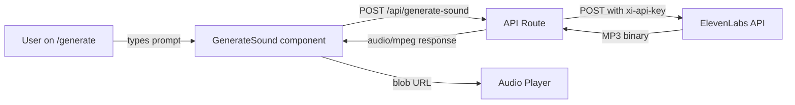

# Design Document: AI Sound Generation

## Overview

This feature adds a `/generate` page to the audx app where users describe a UI sound in natural language and receive AI-generated MP3 audio via the ElevenLabs Sound Effects API. The architecture follows the existing Next.js App Router patterns: a server-side API route proxies requests to ElevenLabs (keeping the API key secret), a client-side React hook manages generation state, and a page-level client component composes the UI from suggestion chips, a prompt textarea, generation controls, and an inline audio player.

The design prioritizes:

- Security: API key never reaches the client
- Responsiveness: loading states, disabled controls during generation, clear error feedback
- Consistency: reuses existing shadcn components, Tailwind theme tokens, and project conventions (`cn()`, `"use client"`, `lib/` for utilities, `hooks/` for custom hooks)



## Architecture

### Component Tree

```
app/generate/page.tsx (Server Component - route entry)
└── GenerateSound (Client Component - "use client")
    ├── SuggestionChips (clickable tags)
    ├── PromptInput (textarea + character count)
    ├── ControlsBar
    │   ├── DurationControl (Auto / 0.5–22s)
    │   └── PromptInfluenceSlider (0–100%)
    ├── GenerateButton (submit, loading state)
    └── AudioResult
        ├── AudioPlayer (play/pause via <audio> element)
        └── DownloadButton
```

### Data Flow

1. User enters a prompt (or clicks a suggestion chip to pre-fill it)
2. User optionally adjusts duration and prompt influence
3. User clicks Generate → `useSoundGenerator` hook fires a `fetch` POST to `/api/generate-sound`
4. API route validates the request body with zod, forwards to ElevenLabs with the server-side API key
5. ElevenLabs returns MP3 binary → API route streams it back with `Content-Type: audio/mpeg`
6. Hook receives the response, creates a blob URL via `URL.createObjectURL`, updates state
7. `AudioResult` renders an `<audio>` element pointed at the blob URL for playback
8. Download button triggers a programmatic `<a>` click on the blob URL

### Key Design Decisions

| Decision                                                    | Rationale                                                                                                                                                                                                                                                             |
| ----------------------------------------------------------- | --------------------------------------------------------------------------------------------------------------------------------------------------------------------------------------------------------------------------------------------------------------------- |
| Use `<audio>` element instead of Web Audio API for playback | The generated audio is a full MP3 file (not a base64 data URI from the registry). An `<audio>` element provides native play/pause/seek with minimal code. The existing `playAudio()` in `lib/audio-engine.ts` expects data URIs and is optimized for short UI sounds. |
| Proxy via API route instead of calling ElevenLabs directly  | Keeps `ELEVEN_LABS_API_KEY` server-side only. Also allows server-side validation and error normalization.                                                                                                                                                             |
| Single client component (`GenerateSound`)                   | Keeps state co-located. The page route (`app/generate/page.tsx`) is a thin server component that just renders `<GenerateSound />`.                                                                                                                                    |
| Blob URL for audio result                                   | Avoids base64 encoding overhead for potentially large MP3 files (up to 22s). Blob URLs are memory-efficient and work natively with `<audio>` and download links.                                                                                                      |
| zod for request validation                                  | Already in the project's dependencies. Provides type-safe validation on the API route.                                                                                                                                                                                |

## Components and Interfaces

### `app/generate/page.tsx`

Server component. Renders `<GenerateSound />` inside a `<main>` wrapper. Exports metadata for SEO.

```typescript
// Thin server component
export default function GeneratePage() {
  return (
    <main className="mx-auto flex w-full max-w-6xl flex-1 flex-col gap-6 px-6 py-8">
      <GenerateSound />
    </main>
  );
}
```

### `components/generate-sound.tsx`

Client component (`"use client"`). Owns all page state via the `useSoundGenerator` hook. Composes:

- Heading section
- `SuggestionChips` — array of `<button>` elements that set the prompt
- `<Textarea>` from `registry/audx/ui/textarea.tsx` for the prompt input
- Controls bar with duration select and prompt influence range input
- Generate button (uses `<Button>` from registry)
- Conditional audio result section (player + download)
- Conditional error message

### `app/api/generate-sound/route.ts`

Next.js Route Handler. Exports a `POST` function.

```typescript
interface GenerateSoundRequest {
  text: string;
  duration_seconds?: number;
  prompt_influence?: number;
}
```

Responsibilities:

1. Parse and validate request body with zod
2. Read `ELEVEN_LABS_API_KEY` from `process.env`
3. POST to `https://api.elevenlabs.io/v1/sound-generation` with `xi-api-key` header
4. On success: return the MP3 binary with `Content-Type: audio/mpeg`
5. On failure: return a JSON error with appropriate status code (400, 500, 502)

### `hooks/use-sound-generator.ts`

Custom hook encapsulating all generation state and logic.

```typescript
interface UseSoundGeneratorReturn {
  // State
  prompt: string;
  setPrompt: (value: string) => void;
  durationSeconds: number | null; // null = "Auto"
  setDurationSeconds: (value: number | null) => void;
  promptInfluence: number; // 0–1, default 0.3
  setPromptInfluence: (value: number) => void;
  isGenerating: boolean;
  error: string | null;
  audioUrl: string | null; // blob URL

  // Actions
  generate: () => Promise<void>;
}
```

The hook:

- Manages `prompt`, `durationSeconds`, `promptInfluence` as React state
- Tracks `isGenerating` (boolean) and `error` (string | null)
- On `generate()`: validates prompt is non-empty, sets `isGenerating`, fetches `/api/generate-sound`, creates blob URL on success, sets error on failure
- Revokes previous blob URL when a new one is created (memory cleanup)
- Revokes blob URL on unmount via `useEffect` cleanup

## Data Models

### API Route Request Schema (zod)

```typescript
import { z } from "zod";

export const generateSoundSchema = z.object({
  text: z.string().min(1, "Prompt is required").max(500, "Prompt too long"),
  duration_seconds: z.number().min(0.5).max(22).optional(),
  prompt_influence: z.number().min(0).max(1).optional(),
});

export type GenerateSoundInput = z.infer<typeof generateSoundSchema>;
```

### ElevenLabs API Request

```typescript
interface ElevenLabsRequest {
  text: string;
  duration_seconds?: number;
  prompt_influence?: number;
}
```

### ElevenLabs API Response

- Success: raw MP3 binary (`Content-Type: audio/mpeg`)
- Error: JSON body with error details (status 4xx/5xx)

### Client-Side State Shape

```typescript
interface GeneratorState {
  prompt: string; // user input, max 500 chars
  durationSeconds: number | null; // null = Auto, 0.5–22
  promptInfluence: number; // 0–1, default 0.3
  isGenerating: boolean;
  error: string | null;
  audioUrl: string | null; // blob:// URL for playback/download
}
```

### Suggestion Chips Data

```typescript
const SUGGESTION_CHIPS = [
  "Soft click",
  "Notification chime",
  "Subtle whoosh",
  "Error buzz",
  "Success ding",
  "Keyboard tap",
] as const;
```

## Correctness Properties

_A property is a characteristic or behavior that should hold true across all valid executions of a system — essentially, a formal statement about what the system should do. Properties serve as the bridge between human-readable specifications and machine-verifiable correctness guarantees._

### Property 1: Suggestion chip click populates prompt

_For any_ suggestion chip in the chip set, clicking that chip should result in the prompt input value being exactly equal to the chip's text content.

**Validates: Requirements 2.2**

### Property 2: Request schema validation

_For any_ input object, the `generateSoundSchema` zod schema should accept it if and only if: `text` is a non-empty string of at most 500 characters, `duration_seconds` (when present) is a number in [0.5, 22], and `prompt_influence` (when present) is a number in [0, 1]. All other inputs should be rejected.

**Validates: Requirements 3.2, 4.2, 5.3**

### Property 3: Prompt influence percentage formatting

_For any_ number `v` in [0, 1], the formatted percentage label should equal `Math.round(v * 100) + "%"`.

**Validates: Requirements 4.4**

### Property 4: API route forwards valid requests to ElevenLabs

_For any_ valid `GenerateSoundInput` (valid text, optional duration_seconds, optional prompt_influence), the API route should forward a POST request to `https://api.elevenlabs.io/v1/sound-generation` containing exactly the provided parameters in the body and the `xi-api-key` header set to the server-side API key.

**Validates: Requirements 5.1, 5.5**

### Property 5: API key never leaked in error responses

_For any_ error response from the ElevenLabs API (4xx or 5xx), the API route's response body (as a string) should not contain the `ELEVEN_LABS_API_KEY` value.

**Validates: Requirements 5.4**

### Property 6: Duplicate submission prevention

_For any_ sequence of N generate button clicks while a generation is already in progress, exactly one API request should be in flight at any time.

**Validates: Requirements 6.3**

### Property 7: New generation replaces previous audio

_For any_ two consecutive successful generations, the audio URL after the second generation should differ from the first, and only one audio player should be rendered.

**Validates: Requirements 7.4**

## Error Handling

### API Route Errors

| Scenario                             | Status | Response                                                           |
| ------------------------------------ | ------ | ------------------------------------------------------------------ |
| Missing or empty `text` field        | 400    | `{ error: "Prompt is required" }`                                  |
| `text` exceeds 500 characters        | 400    | `{ error: "Prompt too long (max 500 characters)" }`                |
| `duration_seconds` out of range      | 400    | `{ error: "Duration must be between 0.5 and 22 seconds" }`         |
| `prompt_influence` out of range      | 400    | `{ error: "Prompt influence must be between 0 and 1" }`            |
| `ELEVEN_LABS_API_KEY` not configured | 500    | `{ error: "Sound generation is not configured" }`                  |
| ElevenLabs returns 4xx               | 502    | `{ error: "Sound generation failed. Please try again." }`          |
| ElevenLabs returns 5xx               | 502    | `{ error: "Sound generation service is temporarily unavailable" }` |
| Network error reaching ElevenLabs    | 502    | `{ error: "Could not reach sound generation service" }`            |
| Unexpected/unknown error             | 500    | `{ error: "An unexpected error occurred" }`                        |

All error responses use `Content-Type: application/json`. The API key is never included in any error response body or headers.

### Client-Side Error Handling

The `useSoundGenerator` hook handles errors as follows:

1. **API errors (non-2xx response)**: Parse the JSON error body and set `error` state to the `error` field value
2. **Network errors (`fetch` throws)**: Set `error` to `"Network error. Please check your connection and try again."`
3. **Unexpected errors**: Set `error` to `"Something went wrong. Please try again."`
4. **State recovery**: On any error, set `isGenerating` to `false`, re-enabling the prompt input and generate button
5. **Error dismissal**: The error message is cleared when the user starts a new generation attempt

### Blob URL Memory Management

- When a new audio blob URL is created, the previous one is revoked via `URL.revokeObjectURL()`
- On component unmount, the current blob URL (if any) is revoked via a `useEffect` cleanup function
- This prevents memory leaks from accumulated blob URLs across multiple generations

## Testing Strategy

### Property-Based Tests

Use `fast-check` as the property-based testing library (TypeScript/JavaScript ecosystem, works with vitest).

Each property test runs a minimum of 100 iterations and is tagged with a comment referencing the design property.

| Property                          | What to Generate                                                                                                                                | What to Assert                                      |
| --------------------------------- | ----------------------------------------------------------------------------------------------------------------------------------------------- | --------------------------------------------------- |
| Property 2: Schema validation     | Random objects with varying `text` lengths (0–1000), `duration_seconds` (−10 to 50), `prompt_influence` (−1 to 2), missing fields, extra fields | Schema accepts iff all fields valid per constraints |
| Property 3: Percentage formatting | Random floats in [0, 1]                                                                                                                         | Formatted string equals `Math.round(v * 100) + "%"` |
| Property 5: API key not leaked    | Random ElevenLabs error responses (various status codes, body content including the API key string)                                             | Response body string does not contain the API key   |

### Unit Tests (Example-Based)

| Test                                                       | Validates    |
| ---------------------------------------------------------- | ------------ |
| Generate page renders within layout with heading           | Req 1.1, 1.2 |
| Suggestion chips are rendered                              | Req 2.1, 2.3 |
| Clicking a chip populates the prompt input                 | Req 2.2      |
| Prompt input has correct placeholder                       | Req 3.1      |
| Generate button is disabled when prompt is empty           | Req 3.3      |
| Duration control defaults to "Auto"                        | Req 4.1      |
| Prompt influence slider defaults to 0.3                    | Req 4.3      |
| API route returns MP3 with correct Content-Type on success | Req 5.2      |
| Generate button triggers POST with correct body            | Req 6.1      |
| Loading state shows indicator and disables inputs          | Req 6.2      |
| Audio player renders after successful generation           | Req 7.1      |
| Download button is present with correct attributes         | Req 7.3      |
| Error message displays on API error                        | Req 8.1      |
| Connectivity error message on network failure              | Req 8.2      |
| Inputs re-enabled after error                              | Req 8.3      |

### Integration Tests

| Test                                                                       | Validates              |
| -------------------------------------------------------------------------- | ---------------------- |
| Full generation flow: enter prompt → click generate → receive audio → play | Req 5.1, 6.1, 7.1, 7.2 |
| API route end-to-end with mocked ElevenLabs                                | Req 5.1–5.5            |

### Test Configuration

- Framework: vitest (already compatible with the Next.js project)
- PBT library: `fast-check`
- Minimum PBT iterations: 100
- Tag format: `Feature: ai-sound-generation, Property {number}: {property_text}`
- Component tests: `@testing-library/react` for DOM assertions
