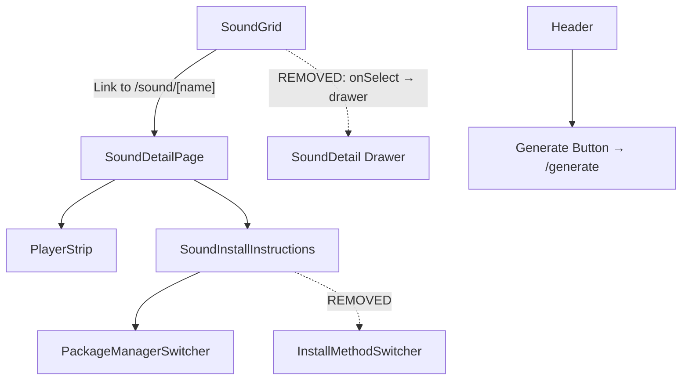

# Design Document: Audio Details Redesign

## Overview

This redesign simplifies the audio browsing experience by removing the intermediate drawer modal, navigating users directly to a redesigned sound detail page, simplifying install instructions to React-only, and adding a Generate button to the header.

The changes are primarily UI refactoring — removing components, simplifying props/types, and updating layouts. No new data models or backend changes are needed.

## Architecture

The change touches the navigation flow and component tree:



Current flow: AudioCard click → `useAudioSelection` sets URL param → Drawer opens
New flow: AudioCard click → Next.js Link navigates to `/sound/[name]`

## Components and Interfaces

### Components to Remove

- `components/sound-detail.tsx` — Drawer modal wrapper (no longer needed)
- `components/install-method-switcher.tsx` — React/Vue/Manual tab switcher (React-only now)
- `components/ui/drawer.tsx` — Vaul drawer primitive (no longer used)

### Components to Modify

**`components/sound-card.tsx`**

- Change from `<button>` with `onSelect` callback to Next.js `<Link href={/sound/${item.name}}>`
- Remove `onSelect` prop
- Keep `onPreviewStart`/`onPreviewStop` for hover audio preview

**`components/sound-grid.tsx`**

- Remove `useAudioSelection` hook import and `handleSelect` usage
- AudioCard no longer needs `onSelect`, just renders Links

**`components/sounds-page.tsx`**

- Remove dynamic import of `SoundDetail`
- Remove `<SoundDetail>` from render output

**`components/sound-detail-page.tsx`**

- Redesign layout per wireframe:
  - Back button (`<`) top-left linking to `/`
  - Two-column section: large sound visualization (left) + name/description (right)
  - Install command block with PackageManagerSwitcher tabs + copy button
  - PlayerStrip at the bottom
- Remove the "Related Audio" section (not in wireframe) or keep as optional
- Remove metadata pills (duration, size, license, tags) from prominent position — simplify

**`components/sound-install-instructions.tsx`**

- Remove `InstallMethodSwitcher` import and state
- Always use `"shadcn"` method — no method selector rendered
- Remove manual setup steps rendering
- Simplified structure: just PackageManagerSwitcher + install command + usage code

**`components/header.tsx`**

- Add a "Generate" Link/button with `RiSparklingLine` icon
- Style: `bg-foreground text-background`
- Links to `/generate`

### Components Unchanged

- `components/package-manager-switcher.tsx` — still used as-is
- `components/sound-player.tsx` (PlayerStrip) — still used as-is
- `components/copy-button.tsx` — still used as-is
- `components/sound-copy-block.tsx` — still used as-is

## Data Models

### `lib/install-method.ts` — Simplify

```typescript
// Before: "shadcn" | "shadcn-vue" | "manual"
// After: only "shadcn" is used, so the type and constants can be removed or reduced
export type InstallMethod = "shadcn";
export const DEFAULT_IM: InstallMethod = "shadcn";
```

The `INSTALL_METHODS` array and `INSTALL_METHOD_LABELS` map can be removed since there's no switcher.

### `lib/audio-snippets.ts` — Simplify `getAudioSnippets`

```typescript
// Before: getAudioSnippets(name, pm, method)
// After:  getAudioSnippets(name, pm) — always uses "shadcn" path
export function getAudioSnippets(
  name: string,
  pm: PackageManager,
): AudioSnippets {
  const exportName = `${toCamelCase(name)}Audio`;
  const prefix = getInstallPrefix(pm);
  const installCmd = `${prefix} add @audx/use-audio @audx/${name}`;
  const usageCode = `import { useAudio } from "@/hooks/use-audio";\nimport { ${exportName} } from "@/sounds/${name}";\n\nconst [play] = useAudio(${exportName});`;
  return { exportName, installCmd, usageCode, setupSteps: null };
}
```

Remove the `shadcn-vue` and `manual` switch cases. Remove `SetupStep` type and related code (manual setup constants `AUDIO_ENGINE_SOURCE`, `AUDIO_TYPES_SOURCE`).

### `hooks/use-sound-selection.ts` — Evaluate removal

This hook manages the `?sound=` query param for the drawer. With the drawer removed, it's no longer needed by `SoundGrid`. If no other component uses it, it can be deleted. The sound detail page uses route params (`/sound/[name]`) instead.

### `components/sound-card.tsx` — Interface change

```typescript
// Before
interface AudioCardProps {
  item: AudioCatalogItem;
  onSelect: (item: AudioCatalogItem) => void;
  onPreviewStart: (audioName: string) => void;
  onPreviewStop: () => void;
}

// After
interface AudioCardProps {
  item: AudioCatalogItem;
  onPreviewStart: (audioName: string) => void;
  onPreviewStop: () => void;
}
```

## Correctness Properties

_A property is a characteristic or behavior that should hold true across all valid executions of a system — essentially, a formal statement about what the system should do. Properties serve as the bridge between human-readable specifications and machine-verifiable correctness guarantees._

### Property 1: AudioCard navigation URL correctness

_For any_ valid AudioCatalogItem, the rendered AudioCard SHALL produce a link with href equal to `/sound/${item.name}`.

**Validates: Requirements 1.1**

### Property 2: getAudioSnippets produces valid React install commands

_For any_ valid sound name and any package manager (npm, pnpm, yarn, bun), `getAudioSnippets(name, pm)` SHALL return a non-null `installCmd` that contains both the sound name and the correct package manager install prefix.

**Validates: Requirements 3.2, 3.3**

## Error Handling

This redesign is UI-only with minimal error surface:

- **Missing sound**: The existing `notFound()` handling in `app/sound/[name]/page.tsx` already covers invalid sound names — no changes needed.
- **Broken links**: AudioCard links are generated from catalog data, so invalid names can't be produced unless the catalog is corrupted.
- **Install command copy**: The existing CopyButton handles clipboard API failures gracefully.
