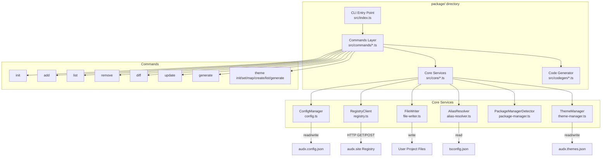

# Design Document: audx-cli

## Overview

The audx CLI is a standalone Node.js command-line tool (npm package name: `audx`) that lives in the `package/` directory at the workspace root. It provides a purpose-built interface for installing, managing, generating, and theming UI sounds from the audx registry at `https://audx.site`.

The CLI replaces the generic shadcn CLI approach with a domain-specific tool that understands the audx registry format natively. It handles fetching registry items (JSON with inline file content), writing TypeScript sound modules to disk, rewriting import paths based on the user's tsconfig path aliases, managing a local config manifest, and generating type-safe theme provider code.

Key design goals:

- Zero runtime dependencies beyond Commander.js and Zod for CLI parsing/validation
- Faithful reproduction of registry file content with correct import path rewriting
- Round-trip safe config file parsing (serialize → deserialize = identity)
- Deterministic code generation for theme files

## Architecture



The architecture follows a three-layer pattern:

1. **Commands Layer** — Thin command handlers registered with Commander.js. Each command validates arguments, calls core services, and formats output. No business logic lives here.
2. **Core Services Layer** — Stateless modules that encapsulate domain logic: config parsing/validation, registry HTTP communication, file writing with import rewriting, path alias resolution, package manager detection, and theme management.
3. **Code Generation Layer** — Template-based code generator that produces the `sound-theme.ts` file from theme configuration. Uses string interpolation (no template engine dependency).

### Package Structure

```
package/
├── src/
│   ├── index.ts              # CLI entry point, Commander setup
│   ├── commands/
│   │   ├── init.ts
│   │   ├── add.ts
│   │   ├── list.ts
│   │   ├── remove.ts
│   │   ├── diff.ts
│   │   ├── update.ts
│   │   ├── generate.ts
│   │   └── theme.ts          # All theme subcommands
│   ├── core/
│   │   ├── config.ts          # ConfigManager: parse, validate, read, write
│   │   ├── registry.ts        # RegistryClient: fetch items, fetch catalog
│   │   ├── file-writer.ts     # FileWriter: write files with import rewriting
│   │   ├── alias-resolver.ts  # AliasResolver: tsconfig path alias resolution
│   │   ├── package-manager.ts # detect package manager from lock files
│   │   └── theme-manager.ts   # ThemeManager: read/write theme config
│   ├── codegen/
│   │   └── theme-codegen.ts   # Generate sound-theme.ts
│   └── types.ts               # Shared TypeScript types
├── tsconfig.json
├── package.json
└── README.md
```

## Components and Interfaces

### CLI Entry Point (`src/index.ts`)

Registers all commands with Commander.js and sets the version/description. When invoked without a subcommand, displays help.

```typescript
#!/usr/bin/env node
import { Command } from "commander";
// register commands...
program.parse();
```

### ConfigManager (`src/core/config.ts`)

Responsible for reading, writing, and validating `audx.config.json`.

```typescript
interface ConfigManager {
  read(projectRoot: string): AudxConfig;
  write(projectRoot: string, config: AudxConfig): void;
  validate(raw: unknown): AudxConfig; // throws on invalid
  exists(projectRoot: string): boolean;
}
```

Uses Zod for schema validation. The `validate` function ensures round-trip safety: `validate(JSON.parse(JSON.stringify(config)))` always equals the original config.

### RegistryClient (`src/core/registry.ts`)

HTTP client for the audx registry. Uses Node.js built-in `fetch` (Node 18+).

```typescript
interface RegistryClient {
  fetchItem(registryUrl: string, name: string): Promise<RegistryItem>;
  fetchCatalog(registryUrl: string): Promise<RegistryCatalog>;
  generateSound(
    registryUrl: string,
    params: GenerateSoundParams,
  ): Promise<Buffer>;
}
```

- `fetchItem` — GET `{registryUrl}/r/{name}.json`, returns parsed JSON
- `fetchCatalog` — GET `{registryUrl}/r/registry.json`, returns full catalog
- `generateSound` — POST `{registryUrl}/api/generate-sound`, returns raw audio bytes

### AliasResolver (`src/core/alias-resolver.ts`)

Reads `tsconfig.json` and resolves path aliases for import rewriting.

```typescript
interface AliasResolver {
  loadFromTsConfig(projectRoot: string): AliasMap;
  resolveImport(
    aliasMap: AliasMap,
    sourceFilePath: string,
    targetModulePath: string,
  ): string;
  computeRelativePath(sourceFilePath: string, targetModulePath: string): string;
}
```

- When aliases exist (e.g., `@/*` → `./*`), `resolveImport` returns `@/lib/audio-types`
- When no aliases exist, it computes a relative path like `../lib/audio-types`
- The resolver strips file extensions from import paths

### FileWriter (`src/core/file-writer.ts`)

Writes registry file content to disk with import path rewriting.

```typescript
interface FileWriter {
  writeRegistryFile(
    file: RegistryFile,
    targetDir: string,
    aliasMap: AliasMap,
    config: AudxConfig,
  ): string; // returns written file path
  rewriteImports(
    content: string,
    sourceFilePath: string,
    aliasMap: AliasMap,
    config: AudxConfig,
  ): string;
}
```

The `rewriteImports` function finds `@/lib/...` and `@/hooks/...` import patterns in registry file content and rewrites them to match the user's project structure and alias configuration.

### PackageManagerDetector (`src/core/package-manager.ts`)

Detects the project's package manager by checking for lock files.

```typescript
type PackageManager = "bun" | "pnpm" | "yarn" | "npm";

function detectPackageManager(projectRoot: string): PackageManager;
```

Detection order: `bun.lock` → `pnpm-lock.yaml` → `yarn.lock` → `package-lock.json` → defaults to `npm`.

### ThemeManager (`src/core/theme-manager.ts`)

Manages the `audx.themes.json` file.

```typescript
interface ThemeManager {
  read(projectRoot: string): ThemeConfig;
  write(projectRoot: string, config: ThemeConfig): void;
  exists(projectRoot: string): boolean;
  setActiveTheme(config: ThemeConfig, themeName: string): ThemeConfig;
  mapSound(
    config: ThemeConfig,
    semanticName: SemanticSoundName,
    soundPath: string,
  ): ThemeConfig;
  createTheme(config: ThemeConfig, themeName: string): ThemeConfig;
  removeSoundMappings(config: ThemeConfig, soundName: string): ThemeConfig;
}
```

All mutation methods return a new `ThemeConfig` (immutable pattern) — the caller writes it back.

### ThemeCodegen (`src/codegen/theme-codegen.ts`)

Generates the `sound-theme.ts` file from theme configuration.

```typescript
interface ThemeCodegen {
  generate(
    themeConfig: ThemeConfig,
    aliasMap: AliasMap,
    config: AudxConfig,
  ): string; // returns generated TypeScript source
}
```

The generated file exports:

- `SemanticSoundName` — union type of all semantic names
- `soundThemes` — object mapping theme names to their sound mappings
- `play(name: SemanticSoundName)` — plays the mapped sound in the active theme
- `setSoundTheme(themeName: string)` — switches the active theme at runtime

## Data Models

### AudxConfig (`audx.config.json`)

```typescript
const audxConfigSchema = z.object({
  $schema: z.string().optional(),
  soundDir: z.string(), // e.g., "src/sounds"
  libDir: z.string(), // e.g., "src/lib"
  registryUrl: z.string().url(), // e.g., "https://audx.site"
  packageManager: z.enum(["npm", "pnpm", "yarn", "bun"]),
  aliases: z.object({
    lib: z.string(), // e.g., "@/lib"
    hooks: z.string(), // e.g., "@/hooks"
    sounds: z.string(), // e.g., "@/sounds"
  }),
  installedSounds: z.record(
    z.string(),
    z.object({
      files: z.array(z.string()), // installed file paths
      installedAt: z.string().datetime(),
    }),
  ),
});

type AudxConfig = z.infer<typeof audxConfigSchema>;
```

Example:

```json
{
  "$schema": "https://audx.site/schema/config.json",
  "soundDir": "src/sounds",
  "libDir": "src/lib",
  "registryUrl": "https://audx.site",
  "packageManager": "pnpm",
  "aliases": {
    "lib": "@/lib",
    "hooks": "@/hooks",
    "sounds": "@/sounds"
  },
  "installedSounds": {
    "click-001": {
      "files": [
        "src/sounds/click-001.ts",
        "src/lib/audio-types.ts",
        "src/lib/audio-engine.ts"
      ],
      "installedAt": "2025-01-15T10:30:00.000Z"
    }
  }
}
```

### ThemeConfig (`audx.themes.json`)

```typescript
const SEMANTIC_SOUND_NAMES = [
  "success",
  "error",
  "warning",
  "info",
  "click",
  "back",
  "enter",
  "delete",
  "copy",
  "paste",
  "scroll",
  "hover",
  "toggle",
  "notify",
  "complete",
  "loading",
] as const;

type SemanticSoundName = (typeof SEMANTIC_SOUND_NAMES)[number];

const themeConfigSchema = z.object({
  activeTheme: z.string(),
  themes: z.record(
    z.string(),
    z.record(
      z.enum(SEMANTIC_SOUND_NAMES),
      z.string().nullable(), // file path or null
    ),
  ),
});

type ThemeConfig = z.infer<typeof themeConfigSchema>;
```

Example:

```json
{
  "activeTheme": "default",
  "themes": {
    "default": {
      "success": null,
      "error": null,
      "click": "src/sounds/click-001.ts",
      "back": "src/sounds/back-001.ts"
    }
  }
}
```

### RegistryItem (fetched from registry)

```typescript
interface RegistryItem {
  $schema: string;
  name: string;
  type: string; // "registry:block" | "registry:lib" | "registry:hook"
  title: string;
  author?: string;
  description: string;
  files: RegistryFile[];
  meta?: {
    duration: number;
    format: string;
    sizeKb: number;
    license: string;
    tags: string[];
  };
}

interface RegistryFile {
  path: string; // e.g., "registry/audx/sounds/click-001/click-001.ts"
  content: string; // inline TypeScript source
  type: string; // "registry:lib" | "registry:hook"
}
```

### RegistryCatalog (fetched from registry)

```typescript
interface RegistryCatalog {
  $schema: string;
  name: string;
  homepage: string;
  items: RegistryCatalogItem[]; // same as RegistryItem but without file content
}
```

### AliasMap

```typescript
interface AliasMap {
  hasAliases: boolean;
  patterns: Array<{
    alias: string; // e.g., "@/*"
    paths: string[]; // e.g., ["./*"]
  }>;
}
```

### GenerateSoundParams

```typescript
interface GenerateSoundParams {
  text: string;
  duration_seconds?: number; // 0.5–22
  prompt_influence?: number; // 0–1
}
```

## Correctness Properties

_A property is a characteristic or behavior that should hold true across all valid executions of a system — essentially, a formal statement about what the system should do. Properties serve as the bridge between human-readable specifications and machine-verifiable correctness guarantees._

### Property 1: Config serialization round-trip

_For any_ valid `AudxConfig` object, serializing it to JSON and parsing it back with the config validator SHALL produce an object deeply equal to the original.

**Validates: Requirements 11.4**

### Property 2: Alias resolution round-trip

_For any_ valid tsconfig path alias mapping and any file path within the project, resolving the file path to an aliased import and then computing the filesystem path from that alias SHALL produce the original file path.

**Validates: Requirements 12.4**

### Property 3: Package manager detection precedence

_For any_ combination of lock files present in a project directory, the detected package manager SHALL follow the precedence order: bun (if `bun.lock` exists) > pnpm (if `pnpm-lock.yaml` exists) > yarn (if `yarn.lock` exists) > npm (if `package-lock.json` exists) > npm (default).

**Validates: Requirements 2.2**

### Property 4: Import rewriting correctness

_For any_ TypeScript source content containing `@/lib/` or `@/hooks/` import paths, and any valid alias configuration, the `rewriteImports` function SHALL produce content where all import paths resolve to the correct filesystem locations given the target file's position and the alias map.

**Validates: Requirements 3.3, 12.2, 12.3**

### Property 5: File routing by registry type

_For any_ registry item with files of varying `type` fields, writing those files SHALL place `registry:lib` files in the configured `libDir` and `registry:hook` files in the `hooks` directory sibling to `libDir`, and sound files (from `registry:block` items) in the configured `soundDir`.

**Validates: Requirements 3.2**

### Property 6: Dependency installation idempotence

_For any_ set of already-installed dependency files and any registry item being added, the file writer SHALL write dependency files only when they do not already exist at the target path. Applying the add operation twice with the same registry item SHALL produce the same filesystem state as applying it once.

**Validates: Requirements 3.5**

### Property 7: Install updates config manifest

_For any_ valid sound name and successful installation, the resulting `installedSounds` in the config SHALL contain an entry for that sound with the correct file paths and a valid ISO timestamp, and all previously installed sounds SHALL remain unchanged.

**Validates: Requirements 3.6, 8.6**

### Property 8: List filtering correctness

_For any_ registry catalog and any tag filter, the filtered results SHALL contain exactly the items whose `meta.tags` array includes the specified tag. _For any_ registry catalog and any search query string, the filtered results SHALL contain exactly the items where the query appears (case-insensitive) in the name, description, or tags.

**Validates: Requirements 4.3, 4.4**

### Property 9: Theme mutation correctness

_For any_ valid theme config: (a) setting the active theme to a valid theme name SHALL update only the `activeTheme` field; (b) mapping a semantic name to a sound path in the active theme SHALL update only that mapping in the active theme; (c) creating a new theme SHALL add an entry with all 16 semantic sound names mapped to `null` and leave existing themes unchanged.

**Validates: Requirements 6.1, 6.3, 6.6**

### Property 10: Theme code generation correctness

_For any_ valid theme configuration and alias map, the generated `sound-theme.ts` source code SHALL contain: a `SemanticSoundName` type union with all mapped semantic names, a `soundThemes` object with entries for each theme, a `play` function, a `setSoundTheme` function, and all import paths SHALL use the resolved aliases from the provided alias map.

**Validates: Requirements 7.1, 7.2, 7.3, 7.4, 7.5, 7.7**

### Property 11: Kebab-case name derivation

_For any_ non-empty prompt string, deriving a name from the first three words SHALL produce a valid kebab-case string (lowercase, words joined by hyphens, no special characters) containing at most three segments.

**Validates: Requirements 8.3**

### Property 12: Base64 audio encoding round-trip

_For any_ byte buffer representing audio data, encoding it as a base64 data URI with the `audio/mpeg` MIME type and then decoding the base64 portion back to bytes SHALL produce a buffer identical to the original.

**Validates: Requirements 8.5**

### Property 13: Remove updates config and theme mappings

_For any_ installed sound that is removed: (a) the sound's entry SHALL be absent from `installedSounds` after removal; (b) all theme mappings referencing the removed sound's file path SHALL be set to `null`; (c) all other `installedSounds` entries and theme mappings SHALL remain unchanged.

**Validates: Requirements 9.2, 9.3**

### Property 14: Shared dependency preservation on remove

_For any_ set of installed sounds where multiple sounds share dependency files (e.g., `audio-types.ts`, `audio-engine.ts`), removing a sound SHALL delete only the sound's own module file and SHALL preserve all shared dependency files that are still referenced by other installed sounds.

**Validates: Requirements 9.6**

### Property 15: Config validation rejects invalid configs

_For any_ JSON object that is missing one or more of the required fields (`soundDir`, `libDir`, `registryUrl`, `aliases`), the config validator SHALL reject it and the error SHALL list exactly the missing field names.

**Validates: Requirements 11.1, 11.3**

## Error Handling

Error handling follows a consistent pattern across all commands:

### Error Categories

1. **Missing Config** — Commands that require `audx.config.json` (all except `init`) check for its existence first. If missing, display: `"Configuration not found. Run 'audx init' first."` and exit with code 1.

2. **Invalid Config** — If `audx.config.json` exists but fails Zod validation, display the parse error or list of missing fields with the file path. Exit with code 1.

3. **Network Errors** — Registry fetch failures display: `"Could not reach the audx registry at {url}. Check your network connection."` Individual sound fetch failures during batch operations (diff, update) log a warning and continue processing remaining sounds.

4. **HTTP Errors** — Non-200 responses from the registry include the sound name and HTTP status code: `"Failed to fetch '{name}': HTTP {status}"`. API generation errors forward the error message from the response body.

5. **File Conflicts** — When a target file already exists, prompt the user with: `"File '{path}' already exists. Overwrite? (y/N)"`. Default to "no" if no input is provided.

6. **Invalid Arguments** — Invalid semantic sound names, non-existent theme names, and uninstalled sound references produce specific error messages listing the valid options.

7. **Missing Project** — `audx init` in a directory without `package.json` displays: `"No package.json found. Run 'audx init' inside a Node.js project."` and exits with code 1.

### Exit Codes

- `0` — Success
- `1` — User error (missing config, invalid arguments, missing project)
- `2` — Network/API error (unreachable registry, API failure)

### Error Output

All errors are written to stderr. Normal output goes to stdout. This allows piping and redirection to work correctly.

## Testing Strategy

### Property-Based Testing

This feature is well-suited for property-based testing. The core services are pure functions with clear input/output behavior: config parsing, alias resolution, import rewriting, filtering, theme mutations, and code generation all operate on structured data with universal properties.

**Library**: [fast-check](https://github.com/dubzzz/fast-check) for TypeScript property-based testing.

**Configuration**: Minimum 100 iterations per property test.

**Tag format**: `Feature: audx-cli, Property {number}: {property_text}`

Each correctness property (1–15) maps to a single property-based test. Generators will produce:

- Random valid `AudxConfig` objects (for round-trip and validation tests)
- Random tsconfig path configurations (for alias resolution tests)
- Random combinations of lock files (for package manager detection)
- Random TypeScript source with import statements (for import rewriting)
- Random registry items with varying file types (for file routing)
- Random catalog items with tags/descriptions (for filtering)
- Random theme configurations (for theme mutations and codegen)
- Random prompt strings (for kebab-case derivation)
- Random byte buffers (for base64 round-trip)

### Unit Tests (Example-Based)

Unit tests cover specific scenarios, edge cases, and integration points:

- `init` command creates config with correct defaults
- `init` detects existing config and prompts
- `init` fails without `package.json`
- `add` with multiple sounds installs all
- `add` prompts on existing file conflict
- `add` fails without config
- `add` fails on HTTP error (various status codes)
- `list` displays formatted table
- `theme init` creates correct default structure
- `theme list` shows active indicator
- `generate` with `--name` uses provided name
- `generate` with `--duration` includes in request
- `remove` deletes file and updates config
- `remove` batch operation
- `remove` fails for non-installed sound
- `diff` shows up-to-date message when no changes
- `update` updates timestamp
- `update` continues on individual fetch failure

### Integration Tests

Integration tests verify end-to-end flows with mocked HTTP:

- Full `init` → `add` → `theme init` → `theme map` → `theme generate` workflow
- `add` → `remove` → verify cleanup
- `add` → `diff` → `update` cycle
- `generate` → verify sound module file structure

### Test Organization

```
package/
├── src/
│   └── ...
├── tests/
│   ├── properties/          # Property-based tests (fast-check)
│   │   ├── config.prop.test.ts
│   │   ├── alias-resolver.prop.test.ts
│   │   ├── import-rewriter.prop.test.ts
│   │   ├── file-router.prop.test.ts
│   │   ├── filtering.prop.test.ts
│   │   ├── theme-manager.prop.test.ts
│   │   ├── theme-codegen.prop.test.ts
│   │   ├── package-manager.prop.test.ts
│   │   ├── name-derivation.prop.test.ts
│   │   ├── base64.prop.test.ts
│   │   └── remove.prop.test.ts
│   ├── unit/                # Example-based unit tests
│   │   ├── commands/
│   │   └── core/
│   └── integration/         # End-to-end flow tests
│       └── workflows.test.ts
```
