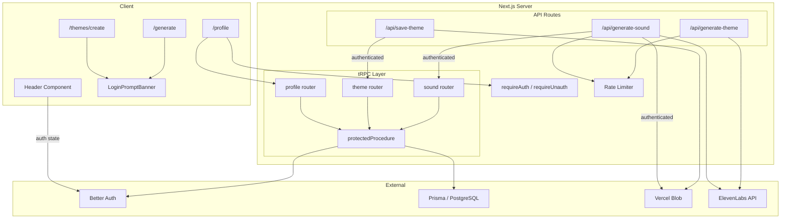
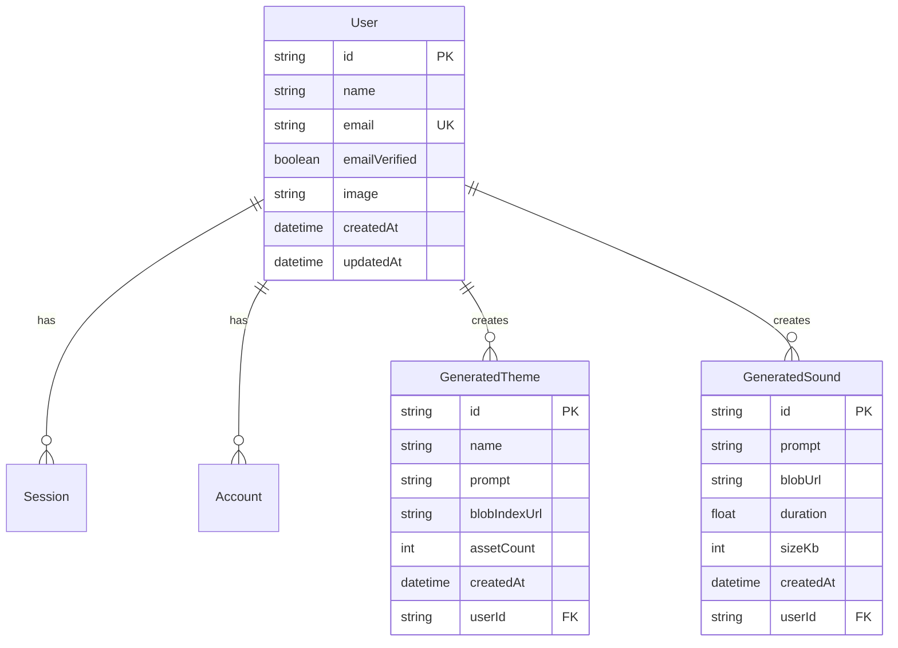

# Design Document: Auth Integration

## Overview

This design integrates the existing Better Auth authentication system into the audx application so that AI-generated themes and sounds are persisted to PostgreSQL with user ownership, unauthenticated users see login prompts on generation pages, a profile page surfaces user-generated content, single-sound generation uploads to Vercel Blob for authenticated users, and rate limits protect API costs for unauthenticated visitors.

The existing auth infrastructure (`lib/auth.ts`, `lib/auth-client.ts`, `lib/auth-utils.ts`, `trpc/init.ts` with `protectedProcedure`) is already in place. This feature extends it by:

1. Adding `GeneratedTheme` and `GeneratedSound` Prisma models linked to `User`
2. Creating tRPC routers for CRUD operations on generated content behind `protectedProcedure`
3. Modifying the `/api/generate-sound` and `/api/save-theme` routes to persist metadata for authenticated users
4. Adding a `/profile` page with auth guard
5. Adding login prompt banners on `/generate` and `/themes/create` for unauthenticated users
6. Implementing IP-based rate limiting for unauthenticated sound generation
7. Gating full theme generation (approve preview) behind authentication
8. Updating the header to reflect auth state

## Architecture



### Key Design Decisions

1. **API routes stay as REST, tRPC for data queries**: The existing `/api/generate-sound` and `/api/save-theme` routes use SSE streaming and binary responses which don't fit tRPC's RPC model. These remain as REST API routes but gain auth-awareness. tRPC `protectedProcedure` is used for profile data retrieval and listing user-generated content.

2. **Rate limiting via in-memory Map with IP key**: For the MVP, an in-memory `Map<string, { count: number; resetAt: number }>` keyed by IP address is sufficient. This resets on server restart, which is acceptable for Vercel serverless (each cold start gets a fresh map, and the short function lifetime naturally limits abuse). A Redis-backed solution can replace this later.

3. **Auth state in header via `authClient.useSession()`**: The Better Auth React client already provides a `useSession()` hook. The header becomes a client component that conditionally renders profile/login links.

4. **Login prompt banner as a shared client component**: A single `LoginPromptBanner` component checks session state via `authClient.useSession()` and renders conditionally. It's placed in the generation page layouts.

5. **Theme preview allowed for unauthenticated users, full generation blocked**: The `/api/generate-theme` endpoint continues to work for previews (≤10 sounds). The `approvePreview` flow in `useThemeEditor` checks auth before proceeding to full generation.

## Components and Interfaces

### New Prisma Models

```prisma
model GeneratedTheme {
  id           String   @id @default(cuid())
  name         String
  prompt       String
  blobIndexUrl String
  assetCount   Int
  createdAt    DateTime @default(now())
  userId       String
  user         User     @relation(fields: [userId], references: [id], onDelete: Cascade)

  @@unique([userId, name])
  @@map("generated_theme")
}

model GeneratedSound {
  id        String   @id @default(cuid())
  prompt    String
  blobUrl   String
  duration  Float
  sizeKb    Int
  createdAt DateTime @default(now())
  userId    String
  user      User     @relation(fields: [userId], references: [id], onDelete: Cascade)

  @@map("generated_sound")
}
```

The `User` model gains two relation fields:

```prisma
model User {
  // ... existing fields
  generatedThemes GeneratedTheme[]
  generatedSounds GeneratedSound[]
}
```

### tRPC Routers

#### Profile Router (`trpc/routers/profile.ts`)

```typescript
interface ProfileData {
  user: { id: string; name: string; email: string; image: string | null };
  themes: Array<{ id: string; name: string; createdAt: Date; assetCount: number }>;
  sounds: Array<{ id: string; prompt: string; createdAt: Date; duration: number }>;
}

// Routes:
// getProfile: protectedProcedure → ProfileData
```

#### Theme Router (`trpc/routers/theme.ts`)

```typescript
// Routes:
// create: protectedProcedure.input(CreateThemeInput) → GeneratedTheme
// list: protectedProcedure → GeneratedTheme[]
// getByName: protectedProcedure.input(string) → GeneratedTheme | null
```

#### Sound Router (`trpc/routers/sound.ts`)

```typescript
// Routes:
// create: protectedProcedure.input(CreateSoundInput) → GeneratedSound
// list: protectedProcedure → GeneratedSound[]
```

### Rate Limiter (`lib/rate-limiter.ts`)

```typescript
interface RateLimitResult {
  allowed: boolean;
  remaining: number;
  limit: number;
}

function checkRateLimit(ip: string, limit: number, windowMs: number): RateLimitResult
```

- Tracks request counts per IP in a `Map`
- Window-based: resets after `windowMs` milliseconds
- Returns `{ allowed, remaining, limit }` for the API route to act on
- Pure function over the map state for testability

### Login Prompt Banner (`components/login-prompt-banner.tsx`)

```typescript
// Client component using authClient.useSession()
// Props: none (self-contained)
// Renders: dismissible banner with message + link to /login
// Renders nothing when session exists
```

### Header Auth State (`components/header.tsx`)

The header becomes a hybrid: the outer shell stays a server component, but a new `HeaderAuthNav` client component replaces the static "Generate" link area:

```typescript
// components/header-auth-nav.tsx (client component)
// Uses authClient.useSession()
// Authenticated: shows avatar/name + link to /profile + sign out
// Unauthenticated: shows "Log in" link + "Generate" link
```

### Profile Page (`app/profile/page.tsx`)

```typescript
// Server component
// Uses requireAuth() for redirect guard
// Renders ProfileContent client component that fetches via tRPC
```


### Modified API Routes

#### `/api/generate-sound/route.ts`

Changes:
1. Check session via `auth.api.getSession({ headers })`
2. If unauthenticated: check rate limit → if exceeded, return 429 → otherwise generate and return audio binary only
3. If authenticated: generate audio → upload to Vercel Blob → create `GeneratedSound` record via Prisma → return audio binary (same response format)

#### `/api/save-theme/route.ts`

Changes:
1. Check session via `auth.api.getSession({ headers })`
2. If unauthenticated: return 401
3. If authenticated: existing blob upload flow → additionally create `GeneratedTheme` record via Prisma with userId

#### `/api/generate-theme/route.ts`

Changes:
1. Check session via `auth.api.getSession({ headers })`
2. If unauthenticated and request has >10 sounds (full generation): return 403 with login prompt message
3. If unauthenticated and request has ≤10 sounds (preview): allow through
4. If authenticated: allow all requests

### Client-Side Flow Changes

#### `useThemeEditor` Hook

The `approvePreview` function needs to check auth state before initiating full generation. If unauthenticated, it should set an error prompting login instead of making the API call.

#### `useSoundGenerator` Hook

No changes needed — the API route handles auth/rate-limit logic. The hook already displays error messages from the API response.

## Data Models

### Entity Relationship Diagram



### Unique Constraints

- `GeneratedTheme`: composite unique on `(userId, name)` — a user cannot have two themes with the same name, but different users can
- `GeneratedSound`: no unique constraint — a user can generate the same prompt multiple times

### Indexes

- `GeneratedTheme.userId` — for listing a user's themes
- `GeneratedSound.userId` — for listing a user's sounds
- Both get implicit indexes from the foreign key relation in PostgreSQL

### Rate Limit Data (In-Memory)

```typescript
// Map<string, { count: number; resetAt: number }>
// Key: IP address (from x-forwarded-for or request IP)
// count: number of sounds generated in current window
// resetAt: timestamp when the window resets
// Window: 24 hours (86400000 ms)
// Limit: 2 sounds per window for unauthenticated users
```

### Validation Schemas

```typescript
// CreateThemeInput (Zod)
{
  name: z.string().min(1).max(50).regex(/^[a-z0-9-]+$/),
  prompt: z.string().min(1).max(300),
  blobIndexUrl: z.string().url(),
  assetCount: z.number().int().min(1),
}

// CreateSoundInput (Zod)
{
  prompt: z.string().min(1).max(500),
  blobUrl: z.string().url(),
  duration: z.number().min(0.1).max(30),
  sizeKb: z.number().int().min(1),
}
```


## Correctness Properties

*A property is a characteristic or behavior that should hold true across all valid executions of a system — essentially, a formal statement about what the system should do. Properties serve as the bridge between human-readable specifications and machine-verifiable correctness guarantees.*

### Property 1: Theme record creation round-trip

*For any* valid theme input (name matching `^[a-z0-9-]+$`, prompt 1–300 chars, valid blob URL, positive asset count, and valid userId), creating a `GeneratedTheme` record and then reading it back SHALL return a record with identical name, prompt, blobIndexUrl, assetCount, and userId fields.

**Validates: Requirements 1.1**

### Property 2: Duplicate theme name per user returns conflict

*For any* userId and theme name, if a `GeneratedTheme` record already exists with that (userId, name) pair, attempting to create another record with the same pair SHALL fail with a conflict error. Conversely, creating a theme with the same name but a different userId SHALL succeed.

**Validates: Requirements 1.4**

### Property 3: Sound record creation round-trip

*For any* valid sound input (prompt 1–500 chars, valid blob URL, duration 0.1–30, positive sizeKb, and valid userId), creating a `GeneratedSound` record and then reading it back SHALL return a record with identical prompt, blobUrl, duration, sizeKb, and userId fields.

**Validates: Requirements 2.1**

### Property 4: Profile query returns all user-generated content

*For any* user with N generated themes and M generated sounds, the profile query SHALL return exactly N themes and M sounds, each matching the corresponding record's fields (name, createdAt, assetCount for themes; prompt, createdAt, duration for sounds).

**Validates: Requirements 5.2, 5.3**

### Property 5: Rate limiter enforces per-IP independent limits

*For any* two distinct IP addresses and a configured limit of L requests per window, exhausting the limit on one IP (making L requests) SHALL block subsequent requests from that IP, while the other IP SHALL still have its full L-request allowance. The first L requests from any IP SHALL be allowed, and request L+1 SHALL be blocked.

**Validates: Requirements 6.1, 6.2**

## Error Handling

### API Route Errors

| Scenario | Status Code | Response |
|---|---|---|
| Unauthenticated user calls `/api/save-theme` | 401 | `{ error: "Authentication required to save themes" }` |
| Unauthenticated user attempts full theme generation (>10 sounds) | 403 | `{ error: "Sign in to generate full themes" }` |
| Unauthenticated user exceeds sound generation rate limit | 429 | `{ error: "Generation limit reached. Sign in for unlimited access." }` |
| Duplicate theme name for same user | 409 | `{ error: "Theme already exists" }` |
| Database write failure during theme/sound save | 500 | `{ error: "Failed to save [theme/sound]" }` |
| Blob upload failure | 500 | `{ error: "Failed to upload audio" }` |

### tRPC Errors

| Scenario | Error Code | Message |
|---|---|---|
| No valid session on protectedProcedure | `UNAUTHORIZED` | "Unauthorised, Please Login" |
| Theme not found by name | `NOT_FOUND` | "Theme not found" |
| Invalid input to create procedures | `BAD_REQUEST` | Zod validation message |

### Client-Side Error Handling

- `useThemeEditor`: The `approvePreview` function checks auth state first. If unauthenticated, sets `error` state with a login prompt message instead of making the API call.
- `useSoundGenerator`: Already handles error responses from the API. The 429 rate limit error message will be displayed in the existing error UI.
- Profile page: tRPC query errors are handled by React Query's error state. The `requireAuth` guard prevents unauthenticated access at the page level.

### Rate Limiter Edge Cases

- If `x-forwarded-for` header is missing, fall back to a default key (e.g., `"unknown"`) — this is conservative and may over-limit, but prevents bypass.
- Window reset: when the current time exceeds `resetAt`, the counter resets to 0 and a new window begins.
- Concurrent requests: in-memory Map operations are synchronous in Node.js single-threaded event loop, so no race conditions.

## Testing Strategy

### Property-Based Tests

Property-based testing is appropriate for this feature because several core behaviors involve pure logic with meaningful input variation:

- **Rate limiter logic** (`lib/rate-limiter.ts`): Pure function over a Map, input varies by IP, count, and timing
- **Record creation/retrieval**: Input varies by field values, testing round-trip preservation
- **Duplicate detection**: Input varies by userId/name combinations
- **Profile query completeness**: Input varies by number and content of records

**Library**: `fast-check` (already used in the project's CLI package tests)

**Configuration**: Minimum 100 iterations per property test.

**Tag format**: `Feature: auth-integration, Property {number}: {property_text}`

Each correctness property (1–5) maps to a single property-based test.

### Unit Tests (Example-Based)

- **Unauthenticated sound generation returns audio without DB write** (Req 2.3)
- **Unauthenticated sound generation skips blob upload** (Req 3.2)
- **Audio binary returned regardless of auth status** (Req 3.3)
- **LoginPromptBanner renders for unauthenticated users** (Req 4.1, 4.2)
- **LoginPromptBanner hidden for authenticated users** (Req 4.4)
- **LoginPromptBanner link points to /login** (Req 4.3)
- **Profile page displays user name and email** (Req 5.1)
- **protectedProcedure returns 401 without session** (Req 8.4)
- **Authenticated users bypass rate limit** (Req 6.3)
- **Unauthenticated users can preview themes (≤10 sounds)** (Req 7.1)
- **Unauthenticated users blocked from full theme generation** (Req 7.2)
- **Authenticated users can do both preview and full generation** (Req 7.3)
- **Header shows profile link when authenticated** (Req 11.1)
- **Header shows login link when unauthenticated** (Req 11.2)

### Smoke Tests

- Prisma schema contains `GeneratedTheme` model with correct fields (Req 10.1)
- Prisma schema contains `GeneratedSound` model with correct fields (Req 10.2)
- `GeneratedTheme` has `@@unique([userId, name])` constraint (Req 10.3)
- `User` model has relations to both generated content models (Req 10.4)
- tRPC theme/sound/profile routes use `protectedProcedure` (Req 8.1, 8.2, 8.3)

### Integration Tests

- Theme save uploads to blob storage and stores URL (Req 1.2)
- Authenticated sound generation uploads to blob storage (Req 3.1)
- Auth page guards redirect correctly (Req 9.1, 9.2, 9.3)
- Profile page redirects unauthenticated users (Req 5.4)
