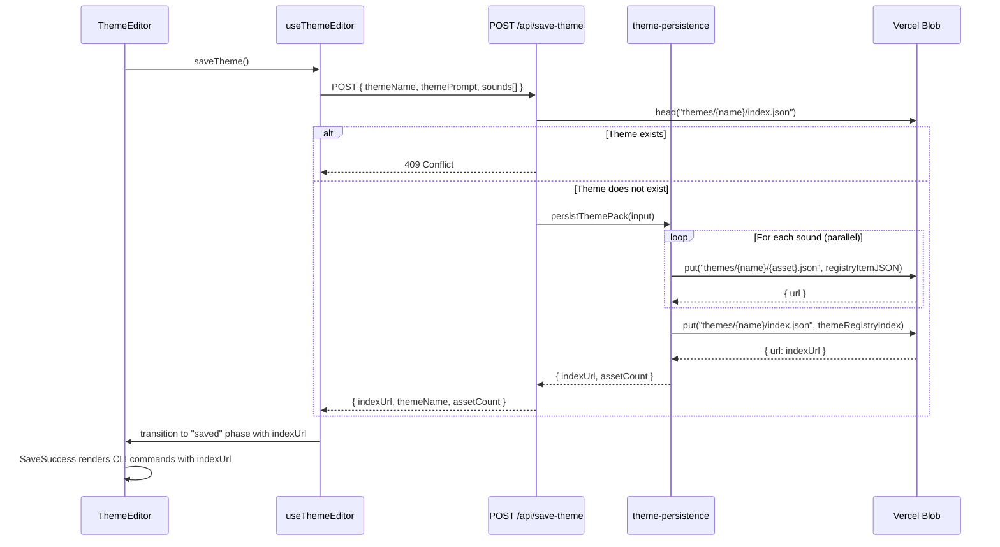

# Design Document: Blob Theme Distribution

## Overview

This feature migrates user-generated theme persistence from the local filesystem to Vercel Blob storage. The current `persistThemePack` function writes sound assets as TypeScript modules, theme definition JSON, and registry entries directly to the server's filesystem — which is ephemeral in Vercel's serverless environment. After this change, each generated theme's assets are uploaded to Vercel Blob as publicly accessible JSON files, enabling the CLI to fetch them via HTTP without a redeploy.

The two built-in themes (minimal, playful) remain served from local JSON imports. The `/themes/[name]` detail page is removed since user-generated themes are no longer browsable on the site — they're consumed exclusively via CLI commands that reference blob URLs.

### Key Design Decisions

1. **Public blob access**: All theme assets use `access: 'public'` since the CLI fetches them via unauthenticated HTTP. This matches the existing registry pattern where `public/r/*.json` files are openly accessible.

2. **Deterministic paths, no random suffix**: Blob paths follow `themes/{themeName}/{assetName}.json` with `addRandomSuffix: false`. This enables duplicate detection via `head()` and produces predictable, shareable URLs.

3. **Registry-compatible JSON format**: Each uploaded blob is a `RegistryItem`-shaped JSON file, so the CLI's existing `fetchItem` function can consume blob URLs directly without modification.

4. **Parallel uploads with `Promise.all`**: Sound assets are uploaded concurrently to minimize save latency. The theme index is uploaded only after all assets succeed.

## Architecture



### What Changes

| Layer | Current | After |
|---|---|---|
| `lib/theme-persistence.ts` | Writes TS files to `registry/audx/audio/`, theme JSON to `registry/audx/themes/`, updates `registry.json` | Uploads `RegistryItem` JSON to blob at `themes/{name}/{asset}.json`, uploads index to `themes/{name}/index.json` |
| `app/api/save-theme/route.ts` | Checks local filesystem for duplicate, calls `persistThemePack`, returns `{ themePath }` | Checks blob via `head()` for duplicate, calls `persistThemePack`, returns `{ indexUrl, themeName, assetCount }` |
| `hooks/use-theme-editor.ts` | `SAVE_COMPLETE` action has no payload | `SAVE_COMPLETE` carries `indexUrl` in state |
| `components/theme-editor/theme-editor.tsx` | Passes only `themeName` to `SaveSuccess` | Passes `themeName` and `indexUrl` to `SaveSuccess` |
| `components/theme-editor/save-success.tsx` | Shows "View Theme" link, CLI commands reference local registry | Removes "View Theme" link, CLI commands use `--registry {indexUrl}` pattern |
| `app/themes/[name]/page.tsx` | Renders theme detail page | Deleted |
| `components/theme-card.tsx` | Links to `/themes/{name}` | Links to `/themes/{name}` (only built-in themes remain, handled by existing `notFound()` for missing themes) |

### What Does NOT Change

- Built-in themes (minimal, playful) in `registry/audx/themes/`
- `registry.json` — no entries added for user-generated themes
- `public/r/*.json` — built registry files untouched
- CLI package (`package/`) — no code changes needed; `fetchItem` already fetches by URL
- `lib/theme-data.ts` — continues to serve built-in themes from local imports

## Components and Interfaces

### Modified: `lib/theme-persistence.ts`

The module's public API changes from filesystem-based to blob-based persistence.

```typescript
// Existing pure functions remain unchanged:
// - toCamelCaseExport(assetName: string): string
// - toDisplayName(themeName: string): string
// - calculateSizeKb(base64: string): number
// - buildAssetModuleContent(assetName, audioBase64, duration): string
// - buildRegistryEntry(semanticName, themeName, duration, sizeKb): Record<string, unknown>

// NEW: Build a RegistryItem JSON (for blob upload) wrapping the asset module
export function buildRegistryItemJSON(
  semanticName: string,
  themeName: string,
  audioBase64: string,
  duration: number,
): RegistryItemJSON

// NEW: Build the theme registry index
export function buildThemeRegistryIndex(
  themeName: string,
  themePrompt: string,
  assets: Array<{ semanticName: string; blobUrl: string; duration: number; sizeKb: number }>,
): ThemeRegistryIndex

// CHANGED: Now uploads to blob instead of writing to filesystem
export async function persistThemePack(
  input: PersistThemeInput,
): Promise<PersistThemeResult>

// NEW: Check if a theme already exists in blob storage
export async function themeExistsInBlob(themeName: string): Promise<boolean>
```

**Removed functions:**
- `buildThemeDefinition` — replaced by `buildThemeRegistryIndex`

### Modified: `app/api/save-theme/route.ts`

```typescript
// POST handler changes:
// 1. Duplicate check: head() on blob instead of fs.access()
// 2. Calls updated persistThemePack (blob-based)
// 3. Returns { indexUrl, themeName, assetCount } instead of { themePath }
```

### Modified: `hooks/use-theme-editor.ts`

```typescript
// State changes:
interface ThemeEditorState {
  // ... existing fields ...
  indexUrl: string | null;  // NEW: blob URL for theme registry index
}

// Action changes:
type EditorAction =
  | // ... existing actions ...
  | { type: "SAVE_COMPLETE"; indexUrl: string }  // CHANGED: now carries indexUrl
```

### Modified: `components/theme-editor/save-success.tsx`

```typescript
interface SaveSuccessProps {
  themeName: string;
  indexUrl: string;  // NEW: blob URL for CLI commands
}
// - Removes "View Theme" Button/Link
// - CLI commands reference indexUrl for theme installation
```

### Modified: `components/theme-editor/theme-editor.tsx`

```typescript
// PhaseRenderer "saved" case passes indexUrl to SaveSuccess:
case "saved":
  return <SaveSuccess themeName={state.themeName} indexUrl={state.indexUrl!} />;
```

### Deleted: `app/themes/[name]/page.tsx`

Entire file removed. Navigation to `/themes/{name}` returns 404 via Next.js default behavior.

## Data Models

### RegistryItemJSON (uploaded per sound asset)

Each sound asset is uploaded as a JSON blob conforming to the existing `RegistryItem` schema from `package/src/types.ts`. This ensures CLI compatibility without any CLI-side changes.

```typescript
interface RegistryItemJSON {
  $schema: string;
  name: string;                    // e.g. "click-warm-wooden-001"
  type: "registry:block";
  title: string;                   // e.g. "Click (Warm Wooden)"
  description: string;
  author: string;
  files: Array<{
    path: string;                  // e.g. "registry/audx/audio/click-warm-wooden-001/click-warm-wooden-001.ts"
    content: string;               // Full TypeScript module source with inline base64
    type: "registry:lib";
  }>;
  meta: {
    duration: number;
    format: "mp3";
    sizeKb: number;
    license: "CC0";
    tags: string[];
    theme: string;
    semanticName: string;
  };
}
```

**Blob path**: `themes/{themeName}/{semanticName}-{themeName}-001.json`
**Content-Type**: `application/json`

### ThemeRegistryIndex (uploaded once per theme)

```typescript
interface ThemeRegistryIndex {
  name: string;                    // e.g. "warm-wooden"
  displayName: string;             // e.g. "Warm Wooden"
  description: string;             // e.g. "Generated theme: warm wooden clicks"
  author: string;                  // "audx-community"
  assetCount: number;
  mappings: Record<string, string>; // semanticName → blob URL of RegistryItemJSON
  assets: Array<{
    semanticName: string;
    assetName: string;             // e.g. "click-warm-wooden-001"
    blobUrl: string;               // public blob URL
    duration: number;
    sizeKb: number;
  }>;
}
```

**Blob path**: `themes/{themeName}/index.json`

### Save API Response (changed)

```typescript
// Before:
{ success: true; themePath: string }

// After:
{ success: true; indexUrl: string; themeName: string; assetCount: number }
```

### Editor State Addition

```typescript
// Added to ThemeEditorState:
indexUrl: string | null;  // Set on SAVE_COMPLETE, read in "saved" phase
```


## Correctness Properties

*A property is a characteristic or behavior that should hold true across all valid executions of a system — essentially, a formal statement about what the system should do. Properties serve as the bridge between human-readable specifications and machine-verifiable correctness guarantees.*

### Property 1: RegistryItemJSON contains all required fields

*For any* valid combination of semantic sound name, theme name (matching `^[a-z0-9-]+$`), base64 audio string, and positive duration, `buildRegistryItemJSON` SHALL produce a JSON object containing: a `name` field matching `{semanticName}-{themeName}-001`, a `type` of `"registry:block"`, a non-empty `files` array where the first entry has `content` containing the base64 data as a data URI and a `path` matching the asset directory convention, and a `meta` object with `duration`, `format`, `sizeKb`, `license`, `tags`, `theme`, and `semanticName` fields all correctly populated.

**Validates: Requirements 1.1, 1.3**

### Property 2: Blob path construction follows deterministic patterns

*For any* valid theme name (matching `^[a-z0-9-]+$`) and any semantic sound name from the `SEMANTIC_SOUND_NAMES` list, the asset blob path SHALL equal `themes/{themeName}/{semanticName}-{themeName}-001.json` and the index blob path SHALL equal `themes/{themeName}/index.json`.

**Validates: Requirements 1.5, 2.3**

### Property 3: ThemeRegistryIndex contains complete theme metadata and mappings

*For any* valid theme name, theme prompt, and non-empty list of assets (each with a semantic name, blob URL, duration, and sizeKb), `buildThemeRegistryIndex` SHALL produce an index object where: `name` equals the theme name, `displayName` is the title-cased theme name, `description` contains the theme prompt, `assetCount` equals the number of assets, `mappings` has an entry for every semantic name in the input mapping to the corresponding blob URL, and `assets` has an entry for every input asset with matching fields.

**Validates: Requirements 2.2, 2.4**

### Property 4: CLI install commands embed the blob URL as registry source

*For any* valid theme name and any HTTPS blob URL string, the generated CLI install commands SHALL contain the blob URL as a `--registry` argument or equivalent registry source reference, and SHALL contain the theme name in the `theme set` command.

**Validates: Requirements 4.1**

## Error Handling

### Blob Upload Failures

- If any individual `put()` call fails during asset upload, `persistThemePack` throws and the API route catches it, returning HTTP 500 with `{ error: "Failed to save theme" }`.
- Since blob uploads are done with `Promise.all`, a single failure aborts the entire batch. Partial uploads may remain in blob storage but are harmless — they're orphaned JSON files with no index pointing to them.
- Future improvement: could add cleanup logic to delete orphaned blobs on failure, but this is not required for the initial implementation.

### Duplicate Theme Detection

- `themeExistsInBlob` calls `head("themes/{themeName}/index.json")`. If the blob exists, the API returns HTTP 409 with `{ error: "Theme already exists" }`.
- If `head()` throws `BlobNotFoundError`, the theme doesn't exist and we proceed.
- If `head()` throws any other error (network, auth), it propagates as a 500.

### Request Validation

- The existing `saveThemeRequestSchema` (Zod) validates the request body. Invalid requests return HTTP 400 with the first Zod issue message. No changes needed here.

### State Machine Error Recovery

- If the save API returns 409, the `useThemeEditor` hook dispatches `SET_ERROR` with the conflict message and remains in the `review` phase, allowing the user to change the theme name and retry.
- If the save API returns 500, same pattern — error displayed, user can retry.

## Testing Strategy

### Property-Based Tests (Vitest + fast-check)

Property-based tests target the pure functions in `lib/theme-persistence.ts`. These functions have clear input/output behavior and benefit from testing across a wide range of generated inputs.

- **Library**: fast-check (already a dependency in `package/`)
- **Minimum iterations**: 100 per property
- **Tag format**: `Feature: blob-theme-distribution, Property {N}: {title}`

Tests to implement:
1. `buildRegistryItemJSON` completeness (Property 1)
2. Blob path construction (Property 2)
3. `buildThemeRegistryIndex` completeness (Property 3)
4. CLI command string construction (Property 4)

### Unit Tests (Vitest)

Example-based tests for specific scenarios and edge cases:

- **API route**: Mock `@vercel/blob` to test 409 on duplicate, 500 on upload failure, 200 on success with correct response shape
- **Duplicate detection**: Mock `head()` returning metadata vs throwing `BlobNotFoundError`
- **No filesystem writes**: Mock blob, run `persistThemePack`, assert zero `fs.writeFile` / `fs.mkdir` calls
- **Built-in themes preserved**: Verify `getAllThemes()` returns minimal and playful after save
- **State management**: Verify `SAVE_COMPLETE` action stores `indexUrl` in state
- **SaveSuccess component**: Verify no "View Theme" link rendered, verify indexUrl appears in commands

### Integration Tests

- End-to-end save flow with real (or emulated) blob storage
- Verify uploaded JSON is fetchable via the returned URL and parses as valid `RegistryItem`

### Smoke Tests

- Verify `app/themes/[name]/page.tsx` file does not exist
- Verify no remaining links to `/themes/[name]` in components (except theme listing page which links to built-in themes that will 404 — this link should also be updated)
