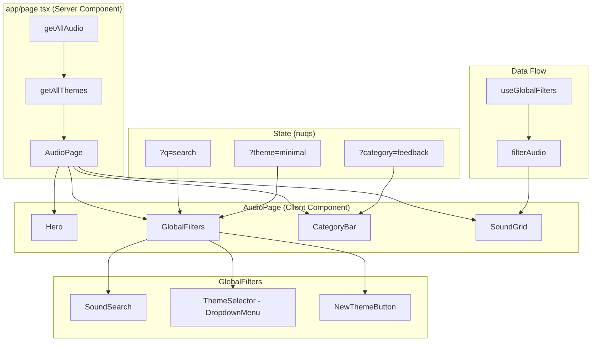

# Design Document: Home Page Refinement

## Overview

This design moves theme selection and category filtering from the separate `/themes` page directly into the home page browse experience. The home page (`AudioPage`) gains three new UI controls — a theme selector dropdown, a "New Theme" button, and a horizontal category badge bar — while the header loses its now-redundant "Themes" and "Create" navigation links.

All new controls live in the sticky filter bar (`GlobalFilters`) and a new `CategoryBar` row, keeping the existing hero and search untouched. State is managed via URL query parameters (using `nuqs`) so that theme and category selections are shareable and bookmarkable.

### Key Design Decisions

1. **URL-driven state via `nuqs`** — Theme (`theme`) and category (`category`) query params are the single source of truth. This keeps the app stateless across refreshes and enables deep-linking.
2. **Reuse existing `DropdownMenu`** — The project already has a shadcn/ui `DropdownMenu` component built on Base UI's `Menu` primitive. We'll use it for the theme selector rather than adding a new `Select` component, keeping the dependency surface small.
3. **Extend `useGlobalFilters` hook** — Rather than creating a separate hook, we extend the existing filter hook to manage theme and category state alongside the search query. This centralises all filter logic.
4. **Extend `filterAudio` in `lib/audio-filters.ts`** — Theme and category filtering is added to the existing pure filter function, making it easy to test.
5. **`CategoryBar` as a new component** — A dedicated component renders the horizontal scrollable badge row, reusing the existing `useHorizontalScroll` hook and shadcn/ui `Badge` component.

## Architecture



### Component Hierarchy

```
app/page.tsx (RSC)
└── AudioPage (client)
    ├── Hero
    ├── GlobalFilters
    │   ├── SoundSearch (existing)
    │   ├── ThemeSelector (new — uses DropdownMenu)
    │   └── NewThemeButton (new — uses Button + Link)
    ├── CategoryBar (new — uses Badge + useHorizontalScroll, shows count per category)
    └── SoundGrid (existing)
```

> **Removed**: The `SoundsCountTitle` component (showing "X Audios" above the grid) is removed from `AudioPage`. Category counts are now shown inline in each category badge instead.

## Components and Interfaces

### 1. ThemeSelector

A dropdown trigger + menu built with the existing `DropdownMenu` component.

```typescript
interface ThemeSelectorProps {
  themes: ThemeCatalogItem[];
  selectedTheme: string;
  onThemeChange: (themeName: string) => void;
}
```

- Renders a `DropdownMenuTrigger` button showing the selected theme's `displayName`.
- Lists all themes as `DropdownMenuRadioItem` entries inside a `DropdownMenuRadioGroup`.
- Uses `RiPaletteLine` icon from Remix Icon as a leading icon on the trigger.

### 2. NewThemeButton

A small button/link that navigates to `/themes/create`.

```typescript
// No props — self-contained Link component
```

- Uses the `Button` component with `variant="outline"` and `size="sm"`.
- Wraps a Next.js `Link` with `asChild` pattern.
- Displays `RiAddLine` icon alongside "New Theme" text.

### 3. CategoryBar

A horizontally scrollable row of category badges, each showing the category name and its sound count.

```typescript
interface CategoryCount {
  name: string;
  count: number;
}

interface CategoryBarProps {
  categories: CategoryCount[];
  selectedCategory: string | null;
  onCategoryChange: (category: string | null) => void;
}
```

- Renders inside a container that uses `useHorizontalScroll` for drag/wheel scrolling.
- Each category is a `Badge` component displaying the category name followed by the count in parentheses, e.g. `Feedback (9)`.
- The active badge uses `variant="default"`, inactive badges use `variant="outline"`.
- Clicking an active badge deselects it (sets `null`). Clicking an inactive badge selects it.
- Categories and their counts are derived from the selected theme's sounds using the `CATEGORIES` map in `lib/theme-data.ts`.

### 4. GlobalFilters (modified)

Extended to include the theme selector and new theme button alongside the existing search.

```typescript
interface GlobalFiltersProps {
  items: AudioCatalogItem[];
  themes: ThemeCatalogItem[];
}
```

### 5. useGlobalFilters (extended)

```typescript
// New query params added:
const [theme, setTheme] = useQueryState("theme", parseAsString.withDefault(""));
const [category, setCategory] = useQueryState("category", parseAsString.withDefault(""));
```

- On mount, if `theme` is empty, defaults to the first theme's `name`.
- When `theme` changes, resets `category` to `""` (all categories).
- `handleClearFilters` now also resets `theme` to default and `category` to `""`.

### 6. filterAudio (extended)

```typescript
export function filterAudio(
  items: AudioCatalogItem[],
  query: string,
  theme?: string,
  category?: string,
): AudioCatalogItem[];
```

- If `theme` is provided, filters items where `item.meta.theme === theme`.
- If `category` is provided, derives the category from `item.meta.semanticName` using the `CATEGORIES` map and filters accordingly.
- Text search continues to work as before, applied after theme/category filtering.

### 7. Header (modified)

- Remove the `<nav>` block containing the "Themes" and "Create" links.
- Keep `AppLogo`, `ThemeToggle`, `GithubStartsButton`, and "Generate" link unchanged.

### 8. app/page.tsx (modified)

- Call `getAllThemes()` alongside `getAllAudio()` and pass themes to `AudioPage`.

## Data Models

### Existing Types (unchanged)

```typescript
// lib/audio-catalog.ts
interface AudioCatalogItem {
  name: string;
  title: string;
  description: string;
  author: string;
  meta: {
    duration: number;
    sizeKb: number;
    license: string;
    tags: string[];
    keywords: string[];
    theme?: string;         // Used for theme filtering
    semanticName?: string;  // Used for category derivation
  };
}

// lib/theme-data.ts
interface ThemeCatalogItem {
  name: string;
  displayName: string;
  description: string;
  author: string;
  soundCount: number;
  mappedCount: number;
}
```

### URL State Shape

| Param      | Type     | Default          | Description                        |
|------------|----------|------------------|------------------------------------|
| `q`        | string   | `""`             | Free-text search query (existing)  |
| `theme`    | string   | first theme name | Selected theme name                |
| `category` | string   | `""`             | Selected category (empty = all)    |

### Category Derivation (with counts)

Categories and their sound counts are derived at runtime from the selected theme's sounds:

```typescript
interface CategoryCount {
  name: string;
  count: number;
}

function getCategoriesForTheme(themeName: string): CategoryCount[] {
  const theme = getThemeByName(themeName);
  if (!theme) return [];
  const countMap = new Map<string, number>();
  for (const s of theme.sounds) {
    countMap.set(s.category, (countMap.get(s.category) ?? 0) + 1);
  }
  return Array.from(countMap.entries())
    .map(([name, count]) => ({ name, count }))
    .sort((a, b) => a.name.localeCompare(b.name));
}
```

This function is called in the component layer (not in the filter function) to produce the list of badges with counts for `CategoryBar`. Each badge displays as `CategoryName (count)`, e.g. `Feedback (9)`.


## Correctness Properties

*A property is a characteristic or behavior that should hold true across all valid executions of a system — essentially, a formal statement about what the system should do. Properties serve as the bridge between human-readable specifications and machine-verifiable correctness guarantees.*

### Property 1: Theme and category filtering returns only matching items

*For any* list of `AudioCatalogItem`s, any theme name, any optional category, and any search query, calling `filterAudio(items, query, theme, category)` SHALL return only items where:
- `item.meta.theme` equals the given theme, AND
- if a category is provided, the category derived from `item.meta.semanticName` via the `CATEGORIES` map equals the given category, AND
- if a query is provided, the item's searchable text contains all query terms.

Furthermore, every item in the original list that satisfies all three conditions SHALL appear in the result (no false negatives).

**Validates: Requirements 1.3, 3.4, 3.5**

### Property 2: Category derivation produces the exact unique set

*For any* theme with a list of sounds (each having a `category` field), the derived category list SHALL equal the sorted, deduplicated set of `category` values from those sounds. No categories are added or omitted.

**Validates: Requirements 3.2**

### Property 3: Filtering is a subset operation

*For any* list of `AudioCatalogItem`s and any combination of theme, category, and query filters, the result of `filterAudio` SHALL be a subset of the input list (every returned item exists in the original list, and the result length is ≤ the input length).

**Validates: Requirements 1.3, 3.5**

## Error Handling

| Scenario | Handling |
|---|---|
| `getAllThemes()` returns empty array | ThemeSelector renders disabled with "No themes" placeholder. CategoryBar renders nothing. Grid shows all items unfiltered. |
| `theme` URL param references a non-existent theme | `useGlobalFilters` falls back to the first available theme and updates the URL param. |
| `category` URL param references a non-existent category | Category is ignored (treated as no category selected). Badge row shows no active selection. |
| `getThemeByName` returns `undefined` for selected theme | CategoryBar renders empty. Filter treats it as no theme filter (shows all items). |
| Audio items have no `meta.theme` or `meta.semanticName` | Items without `meta.theme` are excluded when a theme filter is active. Items without `meta.semanticName` are excluded when a category filter is active. |

## Testing Strategy

### Unit Tests (example-based)

- **ThemeSelector rendering**: Verify all themes appear as menu items; verify selected theme is displayed in trigger.
- **NewThemeButton**: Verify it renders with `RiAddLine` icon and links to `/themes/create`.
- **CategoryBar rendering**: Verify badges render for all categories with correct counts (e.g. "Feedback (9)"); verify active badge has `default` variant; verify inactive badges have `outline` variant.
- **CategoryBar toggle**: Verify clicking active badge deselects; verify clicking inactive badge selects.
- **Theme change resets category**: Verify changing theme sets category to `""`.
- **Header cleanup**: Verify "Themes" and "Create" links are absent; verify AppLogo, ThemeToggle, GithubStartsButton, and Generate link remain.
- **Empty state**: Verify empty state renders when no items match theme + query + category.
- **Default theme on load**: Verify first theme is selected when no `theme` URL param is present.

### Property-Based Tests (fast-check)

Property-based tests use `fast-check` (already a project dependency in the CLI package; add to website devDependencies) with Vitest. Each test runs a minimum of 100 iterations.

- **Property 1**: Generate random arrays of `AudioCatalogItem` with random `meta.theme` and `meta.semanticName` values. Pick a random theme, optional category, and optional query. Assert all results match the filters and no valid items are missing.
  - Tag: `Feature: home-page-refinement, Property 1: Theme and category filtering returns only matching items`

- **Property 2**: Generate random arrays of `ThemeSound` objects with random `category` values. Derive categories and assert the result equals the sorted unique set.
  - Tag: `Feature: home-page-refinement, Property 2: Category derivation produces the exact unique set`

- **Property 3**: Generate random items and random filter params. Assert the result is a strict subset of the input.
  - Tag: `Feature: home-page-refinement, Property 3: Filtering is a subset operation`

### Integration Tests

- Full `AudioPage` render with mock data: verify theme selector → category bar → grid pipeline works end-to-end.
- URL state round-trip: set `?theme=playful&category=feedback`, verify the correct items render.
