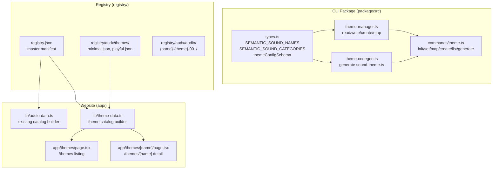

# Design Document: Semantic Sound Vocabulary

## Overview

This feature expands audx's semantic sound vocabulary from 16 to ~65 names organized into 10 categories, delivers two built-in themes ("minimal" and "playful") with real sound assets, and adds a website theme browsing experience. The work spans three layers:

1. **CLI package** (`package/src/types.ts`, theme-manager, theme-codegen) — expand the `SEMANTIC_SOUND_NAMES` array, add category metadata, make schema validation permissive for backward compatibility
2. **Registry** (`registry.json`, `registry/audx/`) — add ~130 new sound assets (65 names × 2 themes), theme definition files, and `meta.theme`/`meta.semanticName` fields
3. **Website** (`app/`, `components/`, `lib/`) — new `/themes` and `/themes/[name]` pages for browsing, previewing, and comparing theme sounds

The design prioritizes backward compatibility: existing `audx.themes.json` files with only the original 16 names remain valid. New names are treated as unmapped (null) when absent.

## Architecture



### Key Design Decisions

1. **Permissive schema validation** — `themeConfigSchema` uses `z.record(z.string(), z.string().nullable())` for theme mappings instead of `z.enum(SEMANTIC_SOUND_NAMES)`. This means old configs with 16 keys and new configs with 65 keys both validate. Unrecognized keys are silently ignored.

2. **Category metadata as a const map** — `SEMANTIC_SOUND_CATEGORIES` is a `Record<SemanticSoundName, CategoryName>` defined alongside `SEMANTIC_SOUND_NAMES` in `types.ts`. This keeps the single source of truth in one file and allows both CLI and website to derive category groupings.

3. **Theme definition files in registry** — Rather than hardcoding theme mappings in the CLI, theme definitions live as JSON files in `registry/audx/themes/`. This makes themes extensible — anyone can add a new theme by adding a JSON file.

4. **Sound asset naming convention** — `{semantic-name}-{theme}-001` (e.g., `click-minimal-001`). The `-001` suffix allows future variants per semantic name per theme.

5. **Registry metadata extension** — Each sound asset's `meta` object gains `theme` and `semanticName` fields. The build script and website filter logic use these for theme-based browsing.

## Components and Interfaces

### 1. Expanded Types (`package/src/types.ts`)

```typescript
// Expanded from 16 to ~65 names
export const SEMANTIC_SOUND_NAMES = [
  // Existing (16)
  "success", "error", "warning", "info", "click", "back", "enter",
  "delete", "copy", "paste", "scroll", "hover", "toggle", "notify",
  "complete", "loading",
  // Interaction (9)
  "tap", "press", "release", "drag", "drop", "select", "deselect",
  "focus", "blur",
  // Navigation (7)
  "forward", "open", "close", "expand", "collapse", "tab", "swipe",
  // Feedback (5)
  "confirm", "cancel", "deny", "undo", "redo",
  // Notification (4)
  "alert", "message", "reminder", "mention",
  // Transition (5)
  "show", "hide", "slide", "fade", "pop",
  // Destructive (4)
  "clear", "remove", "trash", "shred",
  // Progress (5)
  "upload", "download", "refresh", "sync", "process",
  // Clipboard (2)
  "cut", "snapshot",
  // State (6)
  "lock", "unlock", "enable", "disable", "connect", "disconnect",
  // Media (4)
  "mute", "unmute", "record", "capture",
] as const;

export type SemanticSoundName = (typeof SEMANTIC_SOUND_NAMES)[number];

// Category metadata
export const CATEGORY_NAMES = [
  "interaction", "navigation", "feedback", "notification",
  "transition", "destructive", "progress", "clipboard",
  "state", "media",
] as const;

export type CategoryName = (typeof CATEGORY_NAMES)[number];

export const SEMANTIC_SOUND_CATEGORIES: Record<SemanticSoundName, CategoryName> = {
  // existing 16 mapped to their closest categories
  success: "feedback", error: "feedback", warning: "feedback",
  info: "notification", click: "interaction", back: "navigation",
  enter: "interaction", delete: "destructive", copy: "clipboard",
  paste: "clipboard", scroll: "navigation", hover: "interaction",
  toggle: "interaction", notify: "notification", complete: "feedback",
  loading: "progress",
  // new names mapped to their categories...
  tap: "interaction", press: "interaction", release: "interaction",
  // ... (all entries follow the same pattern)
};
```

### 2. Permissive Theme Config Schema (`package/src/types.ts`)

```typescript
// BEFORE (strict — breaks on unknown keys or missing keys):
// z.record(z.enum(SEMANTIC_SOUND_NAMES), z.string().nullable())

// AFTER (permissive — any string keys, nullable string values):
export const themeConfigSchema = z.object({
  activeTheme: z.string(),
  themes: z.record(
    z.string(), // theme name
    z.record(z.string(), z.string().nullable()) // any semantic name → path | null
  ),
});
```

### 3. Theme Manager Updates (`package/src/core/theme-manager.ts`)

The `createTheme` function changes to use the full expanded `SEMANTIC_SOUND_NAMES` array when initializing a new theme. The `removeSoundMappings` function remains unchanged — it already operates on arbitrary string keys.

### 4. Theme Codegen Updates (`package/src/codegen/theme-codegen.ts`)

No structural changes needed. The codegen already collects semantic names dynamically from `themeConfig.themes` via `collectSemanticNames()`. It will naturally handle 65+ names.

### 5. Registry Metadata Extension (`registry.json`)

Each sound asset entry gains two new `meta` fields:

```json
{
  "name": "click-minimal-001",
  "type": "registry:block",
  "title": "Click (Minimal)",
  "description": "A clean, minimal click sound for button interactions.",
  "files": [
    { "path": "registry/audx/audio/click-minimal-001/click-minimal-001.ts", "type": "registry:lib" },
    { "path": "registry/audx/lib/audio-types.ts", "type": "registry:lib" },
    { "path": "registry/audx/lib/audio-engine.ts", "type": "registry:lib" }
  ],
  "meta": {
    "duration": 0.08,
    "format": "mp3",
    "sizeKb": 1,
    "license": "CC0",
    "tags": ["click", "minimal", "interaction"],
    "keywords": ["click", "button", "tap", "minimal", "clean"],
    "theme": "minimal",
    "semanticName": "click"
  }
}
```

### 6. Theme Definition Files (`registry/audx/themes/`)

```json
// registry/audx/themes/minimal.json
{
  "name": "minimal",
  "displayName": "Minimal",
  "description": "Clean, subtle sounds for professional interfaces. Short durations, simple tones.",
  "author": "audx",
  "mappings": {
    "success": "registry/audx/audio/success-minimal-001/success-minimal-001.ts",
    "error": "registry/audx/audio/error-minimal-001/error-minimal-001.ts",
    "click": "registry/audx/audio/click-minimal-001/click-minimal-001.ts",
    // ... all ~65 semantic names
  }
}
```

### 7. Website Theme Data (`lib/theme-data.ts`)

New module that builds theme catalog data from `registry.json` and theme definition files:

```typescript
import { cache } from "react";

export interface ThemeCatalogItem {
  name: string;
  displayName: string;
  description: string;
  author: string;
  soundCount: number;
  mappedCount: number;
}

export interface ThemeSound {
  semanticName: string;
  category: string;
  soundAssetName: string | null;
  duration: number | null;
  sizeKb: number | null;
}

export interface ThemeDetail extends ThemeCatalogItem {
  sounds: ThemeSound[];
}

export const getAllThemes = cache((): ThemeCatalogItem[] => { /* ... */ });
export const getThemeByName = cache((name: string): ThemeDetail | undefined => { /* ... */ });
```

### 8. Website Pages

**`/themes` page** (`app/themes/page.tsx`):
- Server component that calls `getAllThemes()`
- Renders a grid of theme cards (name, description, mapped sound count)
- Each card links to `/themes/[name]`

**`/themes/[name]` page** (`app/themes/[name]/page.tsx`):
- Server component that calls `getThemeByName(name)`
- Client component for interactive features (sound playback, theme comparison, PM switching)
- Sounds organized by category in collapsible sections
- "Compare with" dropdown to hear the same semantic name in another theme
- Installation instructions with package manager switcher and copy button

### 9. Header Navigation Update

Add a "Themes" link to the site header between the logo and the right-side controls.

## Data Models

### Expanded RegistryItem Meta

```typescript
export interface RegistryItemMeta {
  duration: number;
  format: string;
  sizeKb: number;
  license: string;
  tags: string[];
  keywords?: string[];
  theme?: string;        // NEW: "minimal" | "playful" | undefined
  semanticName?: string; // NEW: the semantic name this sound fulfills
}
```

### Theme Definition Schema

```typescript
export interface ThemeDefinition {
  name: string;
  displayName: string;
  description: string;
  author: string;
  mappings: Record<string, string | null>;
}
```

### AudioCatalogItem Extension

The existing `AudioCatalogItem` in `lib/audio-catalog.ts` gains optional theme fields:

```typescript
export interface AudioCatalogItem {
  name: string;
  title: string;
  description: string;
  author: string;
  meta: {
    duration: number;
    sizeKb: number;
    license: string;
    tags: string[];
    keywords: string[];
    theme?: string;        // NEW
    semanticName?: string; // NEW
  };
}
```


## Correctness Properties

*A property is a characteristic or behavior that should hold true across all valid executions of a system — essentially, a formal statement about what the system should do. Properties serve as the bridge between human-readable specifications and machine-verifiable correctness guarantees.*

### Property 1: Permissive theme config schema validation

*For any* record mapping arbitrary string keys to nullable string values, wrapped in a valid `{ activeTheme, themes }` structure, `themeConfigSchema.parse()` SHALL succeed without throwing. This includes subsets of the vocabulary, supersets with unknown keys, and the full vocabulary.

**Validates: Requirements 1.4, 2.1, 2.2, 2.4, 2.5**

### Property 2: New theme initialization covers full vocabulary

*For any* valid theme name string and any existing `ThemeConfig`, calling `createTheme(config, themeName)` SHALL produce a new theme entry where every `SemanticSoundName` in `SEMANTIC_SOUND_NAMES` is present as a key mapped to `null`.

**Validates: Requirements 2.3**

### Property 3: Category mapping completeness and validity

*For any* `SemanticSoundName` in the `SEMANTIC_SOUND_NAMES` array, `SEMANTIC_SOUND_CATEGORIES[name]` SHALL exist and its value SHALL be a member of `CATEGORY_NAMES`.

**Validates: Requirements 3.1, 3.3**

### Property 4: Theme definition covers all vocabulary entries

*For any* theme definition file, its `mappings` object SHALL contain a key for every `SemanticSoundName` in `SEMANTIC_SOUND_NAMES`, and each value SHALL be either a non-empty string path or `null`.

**Validates: Requirements 5.2**

### Property 5: Installation instruction completeness

*For any* theme name and any set of semantic-name-to-sound mappings, the generated installation instructions SHALL contain commands for: theme init, theme create, theme map (for each mapped sound), theme set, and theme generate.

**Validates: Requirements 8.2**

### Property 6: Registry filtering returns only matching items

*For any* filter value (theme name or semantic name), filtering the registry catalog by `meta.theme` or `meta.semanticName` SHALL return only items whose corresponding meta field exactly matches the filter value.

**Validates: Requirements 9.2, 9.3**

### Property 7: Theme codegen produces correct output for any valid config

*For any* valid `ThemeConfig` with at least one theme, the generated TypeScript source SHALL contain: (a) a `SemanticSoundName` type union including every semantic name present across all themes, (b) an import statement for every unique non-null sound path, and (c) `null` entries in the `soundThemes` object for every semantic name mapped to `null`.

**Validates: Requirements 10.1, 10.2, 10.5**

## Error Handling

### CLI Layer

| Scenario | Behavior |
|---|---|
| `audx theme map` with a semantic name not in `SEMANTIC_SOUND_NAMES` | Print error listing valid names, exit code 1 |
| `audx theme set` with a non-existent theme name | Print error listing available themes, exit code 1 |
| `audx theme create` with a name that already exists | Print error, exit code 1 |
| `audx.themes.json` contains unrecognized keys | Silently ignore — permissive schema |
| `audx.themes.json` is missing new vocabulary entries | Treat as unmapped (null) — no error |
| `audx.themes.json` has invalid JSON | Throw parse error with file path context |
| `audx theme generate` without `audx.config.json` | Print "Run 'audx init' first", exit code 1 |
| `audx theme generate` without `audx.themes.json` | Print "Run 'audx theme init' first", exit code 1 |

### Website Layer

| Scenario | Behavior |
|---|---|
| `/themes/[name]` with invalid theme name | Return 404 via `notFound()` |
| Sound asset fails to load/decode | Show error state on the sound entry, don't crash the page |
| Web Audio API not available (SSR) | Guard all audio operations behind `typeof window !== "undefined"` checks |
| Registry item missing `meta.theme` field | Exclude from theme browsing, include in general catalog |
| Theme definition file missing or malformed | Exclude theme from listing, log warning at build time |

### Registry/Build Layer

| Scenario | Behavior |
|---|---|
| Sound asset file missing during `registry:build` | Log error for that item, continue building others |
| Theme definition references non-existent sound asset | Log warning, set mapping to null in built output |
| Duplicate sound asset names in `registry.json` | Last entry wins (existing behavior), log warning |

## Testing Strategy

### Property-Based Tests (Vitest + fast-check)

Property-based testing is appropriate for this feature because the core logic involves:
- Schema validation across a large input space (arbitrary string keys, subsets of vocabulary)
- Pure functions with clear input/output behavior (createTheme, codegen, filtering)
- Universal properties that should hold across all valid inputs

Each property test runs a minimum of 100 iterations. Tests are tagged with the format:
**Feature: semantic-sound-vocabulary, Property {number}: {property_text}**

Library: `fast-check` (already a devDependency in `package/package.json`)

| Property | Test Location | What It Validates |
|---|---|---|
| Property 1: Permissive schema | `package/tests/properties/schema.property.test.ts` | Any string-keyed record validates |
| Property 2: createTheme coverage | `package/tests/properties/theme-manager.property.test.ts` | New themes have all vocabulary keys as null |
| Property 3: Category completeness | `package/tests/properties/categories.property.test.ts` | Every name maps to a valid category |
| Property 4: Theme definition coverage | `package/tests/properties/theme-definition.property.test.ts` | Theme definitions cover all vocabulary |
| Property 5: Install instructions | `package/tests/properties/install-instructions.property.test.ts` | Generated instructions contain all required commands |
| Property 6: Registry filtering | `package/tests/properties/registry-filter.property.test.ts` | Filtering returns only matching items |
| Property 7: Codegen correctness | `package/tests/properties/theme-codegen.property.test.ts` | Generated code has correct types, imports, nulls |

### Unit Tests (Vitest)

| Area | Test Location | What It Validates |
|---|---|---|
| Vocabulary contents | `package/tests/unit/types.test.ts` | All 16 original names present, new names present, total ≤ 70 |
| Category names | `package/tests/unit/types.test.ts` | Exactly 10 category names |
| Old config compat | `package/tests/unit/core/theme-manager.test.ts` | 16-name config validates and operates correctly |
| Theme definition metadata | `package/tests/unit/theme-definition.test.ts` | Each theme def has name, displayName, description, author |
| Naming convention | `package/tests/unit/registry-naming.test.ts` | All theme assets follow `{name}-{theme}-001` pattern |
| Duration constraints | `package/tests/unit/registry-duration.test.ts` | Minimal: 30-300ms, Playful: 50-800ms |
| Codegen setSoundTheme | `package/tests/unit/codegen/theme-codegen.test.ts` | Generated code contains setSoundTheme function |

### Integration Tests

| Area | What It Validates |
|---|---|
| `bun run registry:build` | Generates `public/r/*.json` for all theme assets |
| Website `/themes` page | Renders theme cards with correct data |
| Website `/themes/[name]` page | Renders sounds grouped by category |
| Sound playback | Web Audio API plays sounds on click |
| PM switcher | Installation instructions update per package manager |

### Manual Testing

- Sound asset quality review (listen to each generated sound)
- Visual review of theme browsing pages
- Accessibility review (keyboard navigation, screen reader)
- Mobile responsiveness of theme pages
