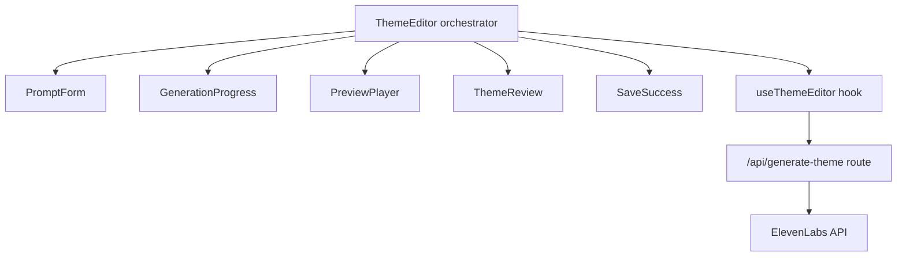

# Design Document: Theme Editor Refinements

## Overview

This design covers six areas of change to the theme editor flow at `/themes/create`:

1. **Cost removal** — Strip `CostEstimate` type, `estimateCost()`, `previewCost`, and `fullCost` from the hook, orchestrator, and child components. The `lib/credit-cost.ts` file remains untouched (used elsewhere).
2. **Fixed 1-second duration** — All theme generation requests (preview, full, retry) send `duration: 1` instead of `template.defaultDuration`. The `/generate` page keeps its own duration control.
3. **PreviewPlayer grid redesign** — Replace the collapsible accordion list with a flat responsive grid of category cards. Each card shows category header, sound name, and play/retry button.
4. **ThemeReview hybrid layout** — Keep collapsible category accordions at the top level, but replace the inner sound list with a responsive grid of sound items.
5. **Rate-limit-safe API throttling** — Add 1.5s inter-request delay and improved 429 handling (respect `retry-after`, exponential backoff with base 2s) to the generate-theme route. Single-sound retries are unaffected.
6. **Estimated time in progress view** — Add "This may take a few minutes" message, elapsed time counter, and estimated time remaining to `GenerationProgress`.

The `generate-theme-schema.ts` validation must also be updated: the `duration` field max changes from `2.0` to accommodate the fixed `1` value (already within range), and the `sounds` array max changes from `65` to `67` to support the full 67-sound generation.

## Architecture

The changes are scoped to the existing component tree with no new architectural patterns:



**Data flow changes:**
- `useThemeEditor` no longer computes or returns `previewCost` / `fullCost`
- `useThemeEditor` hardcodes `duration: 1` in all `fetchSSE` and `retrySound` payloads
- `ThemeEditor` no longer passes cost props to `PromptForm` or `PreviewPlayer`
- `GenerationProgress` receives `startTime` from the parent (already in state) to compute elapsed/estimated time
- `generate-theme/route.ts` adds inter-request delay and improved 429 backoff logic

**Component layout changes:**
- `PreviewPlayer`: accordion → flat responsive grid (no expand/collapse state)
- `ThemeReview`: inner list → responsive grid (accordion stays at category level)

## Components and Interfaces

### useThemeEditor Hook (`hooks/use-theme-editor.ts`)

**Removals:**
- Remove `import { type CostEstimate, estimateCost } from "@/lib/credit-cost"`
- Remove `previewCost` and `fullCost` from the return type and their `useMemo` computations

**Changes to `fetchSSE`:**
```typescript
// Before
duration: template?.defaultDuration ?? 0.3,

// After
duration: 1,
```

**Changes to `retrySound`:**
```typescript
// Before
sounds: [{ semanticName, duration: template.defaultDuration }],

// After
sounds: [{ semanticName, duration: 1 }],
```

**Updated return type:**
```typescript
{
  state: ThemeEditorState;
  setThemeName: (name: string) => void;
  setThemePrompt: (prompt: string) => void;
  startPreview: () => Promise<void>;
  approvePreview: () => Promise<void>;
  rejectPreview: () => void;
  retrySound: (semanticName: string) => Promise<void>;
  saveTheme: () => Promise<void>;
}
```

### ThemeEditor Orchestrator (`components/theme-editor/theme-editor.tsx`)

**Removals:**
- Remove `previewCost` and `fullCost` from the destructured hook return
- Remove `previewCost` prop from `<PromptForm>`
- Remove `fullCost` prop from `<PreviewPlayer>`

**Addition:**
- Pass `startTime={state.startTime}` to `<GenerationProgress>` for elapsed time computation

### PromptForm (`components/theme-editor/prompt-form.tsx`)

**Removals:**
- Remove `previewCost: CostEstimate` from `PromptFormProps`
- Remove `import type { CostEstimate } from "@/lib/credit-cost"`
- Remove `costLabel` variable and the `<p>` element rendering it

### PreviewPlayer (`components/theme-editor/preview-player.tsx`)

**Removals:**
- Remove `fullCost: CostEstimate` from `PreviewPlayerProps`
- Remove `import type { CostEstimate } from "@/lib/credit-cost"`
- Remove `costLabel` variable and cost paragraph
- Remove `expandedCategories` state and `toggleCategory` callback (no more accordion)

**New layout — flat responsive grid:**
```typescript
interface PreviewPlayerProps {
  previewSounds: Map<string, GeneratedSound>;
  onApprove: () => void;
  onReject: () => void;
  onRetrySound: (semanticName: string) => void;
}
```

Grid container uses Tailwind responsive classes:
```
grid grid-cols-1 md:grid-cols-2 lg:grid-cols-3 gap-3
```

Each `CategoryCard` is a bordered card containing:
- Category name header (capitalized, small text)
- Sound name
- Play button (if completed) or retry button (if failed) or status indicator (if pending/generating)

### ThemeReview (`components/theme-editor/theme-review.tsx`)

**Layout change — inner grid:**
The top-level collapsible category accordion remains. Inside each expanded category, replace the vertical list with a responsive grid:

```
grid grid-cols-1 md:grid-cols-2 lg:grid-cols-3 gap-3
```

Each grid item is a bordered card containing:
- Sound name + status indicator
- Play button (if completed)
- Duration label + estimated file size (if completed)
- Retry button (if failed)

### GenerationProgress (`components/theme-editor/generation-progress.tsx`)

**New props:**
```typescript
interface GenerationProgressProps {
  sounds: Map<string, GeneratedSound>;
  progress: { total: number; completed: number; failed: number };
  startTime: number | null;
}
```

**New features:**
- "This may take a few minutes" informational message below the progress bar
- Elapsed time counter using `useEffect` with a 1-second interval, computing `Date.now() - startTime`
- Estimated time remaining: `(total - done) * (elapsed / done)` where `done = completed + failed`
- When `done < 2`, display "Estimating…" instead of a numeric estimate

### Generate Theme Route (`app/api/generate-theme/route.ts`)

**Inter-request delay:**
After each `generateSingleSound` call completes (success or failure), insert a 1.5s delay before releasing the semaphore — but only when the request contains more than 1 sound.

```typescript
const INTER_REQUEST_DELAY_MS = 1500;

// In processSound, after the try/catch, before release():
if (soundJobs.length > 1) {
  await sleep(INTER_REQUEST_DELAY_MS);
}
```

**Improved 429 handling in `generateSingleSound`:**
```typescript
if (response.status === 429) {
  const retryAfter = response.headers.get("retry-after");
  const headerMs = retryAfter ? Number(retryAfter) * 1000 : 0;
  const backoffMs = Math.pow(2, attempt) * 2000; // exponential: 2s, 4s, 8s
  const waitMs = Math.max(headerMs, backoffMs, 5000); // at least 5s
  await sleep(waitMs);
  continue;
}
```

### Schema Update (`lib/generate-theme-schema.ts`)

Update the `sounds` array max from `65` to `67` to support the full set of 67 semantic sound names.

## Data Models

No new data models are introduced. Existing types are modified:

**Removed from public API:**
- `previewCost: CostEstimate` (from hook return)
- `fullCost: CostEstimate` (from hook return)
- `previewCost` prop (from PromptFormProps)
- `fullCost` prop (from PreviewPlayerProps)

**Added to GenerationProgressProps:**
- `startTime: number | null` — timestamp when generation started

**Constants added to route:**
- `INTER_REQUEST_DELAY_MS = 1500`

**No changes to:**
- `ThemeEditorState` (already has `startTime`)
- `GeneratedSound` interface
- `EditorAction` union
- `lib/credit-cost.ts` (file untouched)

## Correctness Properties

*A property is a characteristic or behavior that should hold true across all valid executions of a system — essentially, a formal statement about what the system should do. Properties serve as the bridge between human-readable specifications and machine-verifiable correctness guarantees.*

### Property 1: Fixed 1-second duration in all theme generation requests

*For any* sound name from `SEMANTIC_SOUND_NAMES` and any code path (batch preview, batch full generation, or single-sound retry), the `duration` field in the request payload sent to `/api/generate-theme` SHALL be exactly `1`, regardless of the sound's `defaultDuration` in `SOUND_PROMPT_TEMPLATES`.

**Validates: Requirements 4.1, 4.2, 4.3**

### Property 2: Category card structure in PreviewPlayer

*For any* valid `GeneratedSound` with status "completed" rendered in the PreviewPlayer grid, the corresponding card SHALL contain the sound's category name, semantic name, and a play button element.

**Validates: Requirements 5.4, 5.5**

### Property 3: Failed sound retry in PreviewPlayer

*For any* `GeneratedSound` with status "failed" rendered in the PreviewPlayer grid, the corresponding card SHALL contain a retry button that, when activated, invokes `onRetrySound` with that sound's semantic name.

**Validates: Requirements 5.6**

### Property 4: Completed sound info in ThemeReview grid

*For any* `GeneratedSound` with status "completed" rendered in a ThemeReview category grid, the grid item SHALL display a play button, a duration label, and an estimated file size.

**Validates: Requirements 6.5**

### Property 5: Failed sound retry in ThemeReview grid

*For any* `GeneratedSound` with status "failed" rendered in a ThemeReview category grid, the grid item SHALL contain a retry button that invokes `onRetrySound` with that sound's semantic name.

**Validates: Requirements 6.6**

### Property 6: Save button enable/disable logic

*For any* progress state where `completed` count and `isSaving` flag vary, the "Save Theme" button SHALL be enabled if and only if `completed >= 60` and `isSaving` is false.

**Validates: Requirements 6.8**

### Property 7: 429 retry wait time respects retry-after and minimum

*For any* HTTP 429 response with a `retry-after` header value (or absence thereof) and any retry attempt number, the wait time SHALL be at least `max(retryAfterSeconds * 1000, 2^attempt * 2000, 5000)` milliseconds.

**Validates: Requirements 7.3, 7.4**

### Property 8: Estimated time remaining computation

*For any* generation progress state where `completed + failed >= 2`, `elapsedMs > 0`, and `total > completed + failed`, the estimated time remaining SHALL equal `(total - done) * (elapsedMs / done)` where `done = completed + failed`.

**Validates: Requirements 8.3**

### Property 9: Early estimation guard

*For any* generation progress state where `completed + failed < 2`, the component SHALL display "Estimating…" instead of a numeric time remaining.

**Validates: Requirements 8.4**

## Error Handling

**429 Rate Limiting (enhanced):**
- The route now uses exponential backoff (base 2s) combined with `retry-after` header respect
- Minimum wait of 5 seconds on any 429
- Backoff sequence: 5s minimum → max(retry-after, 4s, 5s) → max(retry-after, 8s, 5s)
- After `MAX_RETRIES` (2) exhausted, the sound is marked as failed and the SSE error event is sent

**Inter-request delay:**
- Only applied for multi-sound requests (>1 sound in payload)
- Single-sound retries from the UI bypass the delay entirely

**Generation progress edge cases:**
- `startTime` is null before generation starts — elapsed counter shows nothing
- Fewer than 2 sounds completed — "Estimating…" shown instead of potentially misleading early estimates
- Division by zero guarded by the `done < 2` check

**Existing error handling preserved:**
- AbortError handling for client disconnects
- Per-sound error isolation (one failure doesn't stop others)
- 5xx retry with backoff
- Non-429 4xx immediate failure

## Testing Strategy

### Unit Tests (example-based)

- **Cost removal smoke tests**: Verify `useThemeEditor` return type has no `previewCost`/`fullCost`, PromptForm renders without cost text, PreviewPlayer renders without cost text
- **PreviewPlayer layout**: Verify grid CSS classes are present, no accordion toggle buttons exist, action buttons render below grid
- **ThemeReview layout**: Verify category accordions still expand/collapse, inner content uses grid layout
- **GenerationProgress**: Verify "This may take a few minutes" message renders, elapsed counter updates
- **Schema**: Verify `generateThemeRequestSchema` accepts 67 sounds with duration=1

### Property-Based Tests (fast-check)

- **Library**: `fast-check` (already in the project's CLI package test setup)
- **Minimum iterations**: 100 per property
- **Tag format**: `Feature: theme-editor-refinements, Property {N}: {title}`

Properties to implement:
1. Fixed 1-second duration in request payloads
2. Category card structure in PreviewPlayer
3. Failed sound retry in PreviewPlayer
4. Completed sound info in ThemeReview
5. Failed sound retry in ThemeReview
6. Save button enable/disable logic
7. 429 retry wait time computation
8. Estimated time remaining computation
9. Early estimation guard

### Integration Tests

- **Concurrency limit**: Mock ElevenLabs API, send 10+ sounds, verify max 2 concurrent requests
- **Inter-request delay**: Mock API, measure timing between consecutive request completions, verify ≥1.5s gap
- **Single-sound bypass**: Send 1-sound request, verify no inter-request delay applied
