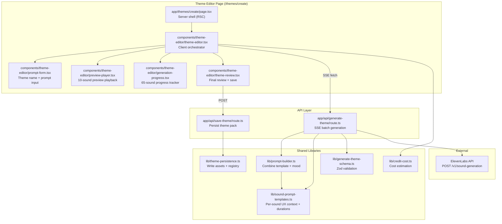

# Design Document: Theme Editor

## Overview

The Theme Editor adds a `/themes/create` page that lets users describe a mood/style via a text prompt and generates a complete 65-sound theme pack using the ElevenLabs Sound Effects API. It introduces a two-phase generation flow — a 10-sound preview (one per category) to evaluate the style cheaply, followed by full 65-sound generation on confirmation. Generated packs are persisted to the registry so other users can browse and install them via the audx CLI.

The feature spans three layers:

1. **API Route** (`app/api/generate-theme/route.ts`) — SSE-based batch generation endpoint that calls ElevenLabs per-sound with concurrency limiting, retry logic, and real-time progress streaming
2. **Client Components** (`components/theme-editor/`) — Multi-step editor UI with prompt input, preview playback, progress tracking, and final review
3. **Persistence** (`lib/theme-persistence.ts`) — Server-side logic to write generated sounds as registry assets, create theme definition files, and update `registry.json`

The existing single-sound `/generate` page and `/api/generate-sound` route remain unchanged. The Theme Editor is a separate, parallel flow.

## Architecture



### Key Design Decisions

1. **SSE for progress streaming** — The `/api/generate-theme` route uses Server-Sent Events rather than WebSockets. SSE is simpler (unidirectional), works through proxies/CDNs, and Next.js App Router supports it natively via `ReadableStream`. Each sound completion emits a JSON event with the base64 audio data.

2. **Two separate API routes** — Generation (`/api/generate-theme`) and persistence (`/api/save-theme`) are split. Generation is long-running and streams progress. Persistence is a single POST that writes files. This separation keeps concerns clean and allows the user to review before saving.

3. **Client-side state machine** — The editor uses a `useReducer`-based state machine with phases: `idle → previewing → preview-ready → generating → review → saving → saved`. This makes transitions explicit and prevents invalid states (e.g., can't save during generation).

4. **Prompt templates as a typed constant** — Each of the 65 semantic names gets a `SoundPromptTemplate` with base UX context, recommended duration, and category. This is defined in `lib/sound-prompt-templates.ts` and shared between the API route (for prompt construction) and the client (for cost estimation).

5. **Concurrency via p-limit** — The API route uses a simple concurrency limiter (implemented inline, no external dep) to cap parallel ElevenLabs requests. Default is 2 for free tier compatibility.

6. **Preview selects one sound per category** — The 10 preview sounds are hardcoded as the most representative per category (e.g., "click" for interaction, "success" for feedback). This is a static mapping, not random.

## Components and Interfaces

### 1. Sound Prompt Template System (`lib/sound-prompt-templates.ts`)

```typescript
export interface SoundPromptTemplate {
  semanticName: string;
  category: string;
  uxContext: string;        // e.g., "short UI button click"
  durationRange: [number, number]; // [min, max] in seconds
  defaultDuration: number;  // recommended duration
}

export const SOUND_PROMPT_TEMPLATES: Record<string, SoundPromptTemplate>;

// The 10 preview representatives (one per category)
export const PREVIEW_SOUNDS: string[];
// e.g., ["click", "back", "success", "alert", "show", "trash", "upload", "copy", "lock", "mute"]
```

### 2. Prompt Builder (`lib/prompt-builder.ts`)

```typescript
export interface BuildPromptInput {
  themePrompt: string;      // user's mood description
  semanticName: string;
  uxContext: string;
  category: string;
}

export interface BuildPromptResult {
  text: string;             // final prompt (≤500 chars)
  duration: number;         // assigned duration in seconds
}

/**
 * Combines the template UX context with the user's mood descriptors.
 * Truncates mood portion if combined prompt exceeds 500 chars.
 */
export function buildSoundPrompt(input: BuildPromptInput): BuildPromptResult;
```

### 3. Zod Schemas (`lib/generate-theme-schema.ts`)

```typescript
import { z } from "zod";

export const themeNameSchema = z.string()
  .min(1).max(50)
  .regex(/^[a-z0-9-]+$/, "Only lowercase letters, numbers, and hyphens");

export const generateThemeRequestSchema = z.object({
  themeName: themeNameSchema,
  themePrompt: z.string().min(1).max(300),
  sounds: z.array(z.object({
    semanticName: z.string(),
    duration: z.number().min(0.1).max(2.0),
  })).min(1).max(65),
});

export type GenerateThemeRequest = z.infer<typeof generateThemeRequestSchema>;

export const saveThemeRequestSchema = z.object({
  themeName: themeNameSchema,
  themePrompt: z.string().min(1).max(300),
  sounds: z.array(z.object({
    semanticName: z.string(),
    audioBase64: z.string(),
    duration: z.number(),
  })).min(60).max(65),
});

export type SaveThemeRequest = z.infer<typeof saveThemeRequestSchema>;
```

### 4. SSE Generation API Route (`app/api/generate-theme/route.ts`)

```typescript
// POST /api/generate-theme
// Request body: GenerateThemeRequest
// Response: SSE stream with events:
//   - { type: "progress", semanticName: string, status: "generating" }
//   - { type: "complete", semanticName: string, audioBase64: string, duration: number }
//   - { type: "error", semanticName: string, error: string }
//   - { type: "done", summary: { total: number, succeeded: number, failed: number, elapsed: number } }

export async function POST(request: Request): Promise<Response> {
  // 1. Validate request body with Zod
  // 2. Check ELEVENLABS_API_KEY
  // 3. Build prompts using buildSoundPrompt()
  // 4. Create ReadableStream for SSE
  // 5. Process sounds with concurrency limit (default 2)
  //    - For each sound: call ElevenLabs, retry on 429/5xx (up to 2 retries)
  //    - Emit progress events
  // 6. Emit done event with summary
}
```

### 5. Theme Persistence (`lib/theme-persistence.ts`)

```typescript
export interface PersistThemeInput {
  themeName: string;
  themePrompt: string;
  sounds: Array<{
    semanticName: string;
    audioBase64: string;
    duration: number;
  }>;
}

export interface PersistThemeResult {
  themeDefinitionPath: string;
  assetCount: number;
  registryUpdated: boolean;
}

/**
 * 1. Write each sound as a TS module in registry/audx/audio/{name}-{theme}-001/
 * 2. Create theme definition JSON in registry/audx/themes/{theme}.json
 * 3. Update registry.json with new asset entries
 * 4. Run registry build (bun run registry:build)
 */
export async function persistThemePack(input: PersistThemeInput): Promise<PersistThemeResult>;
```

### 6. Save Theme API Route (`app/api/save-theme/route.ts`)

```typescript
// POST /api/save-theme
// Request body: SaveThemeRequest
// Response: { success: boolean, themePath: string }

export async function POST(request: Request): Promise<Response> {
  // 1. Validate request body
  // 2. Check if theme name already exists
  // 3. Call persistThemePack()
  // 4. Return success with theme path
}
```

### 7. Credit Cost Estimator (`lib/credit-cost.ts`)

```typescript
export const CREDITS_PER_SECOND = 20;
export const APPROX_DOLLAR_PER_CREDIT = 0.000018; // ~$0.07 per generation reference

export interface CostEstimate {
  totalCredits: number;
  approximateDollars: number;
  soundCount: number;
}

export function estimateCost(sounds: Array<{ duration: number }>): CostEstimate;
```

### 8. Client State Machine (`hooks/use-theme-editor.ts`)

```typescript
export type EditorPhase =
  | "idle"
  | "previewing"
  | "preview-ready"
  | "generating"
  | "review"
  | "saving"
  | "saved";

export interface GeneratedSound {
  semanticName: string;
  category: string;
  audioBase64: string | null;
  audioUrl: string | null;   // blob URL for playback
  duration: number;
  status: "pending" | "generating" | "completed" | "failed";
  error?: string;
}

export interface ThemeEditorState {
  phase: EditorPhase;
  themeName: string;
  themePrompt: string;
  sounds: Map<string, GeneratedSound>;
  previewSounds: Map<string, GeneratedSound>;
  progress: { total: number; completed: number; failed: number };
  error: string | null;
  startTime: number | null;
  elapsedMs: number | null;
}

export function useThemeEditor(): {
  state: ThemeEditorState;
  setThemeName: (name: string) => void;
  setThemePrompt: (prompt: string) => void;
  startPreview: () => Promise<void>;
  approvePreview: () => Promise<void>;
  rejectPreview: () => void;
  retrySound: (semanticName: string) => Promise<void>;
  saveTheme: () => Promise<void>;
  previewCost: CostEstimate;
  fullCost: CostEstimate;
};
```

### 9. Component Structure


**`app/themes/create/page.tsx`** — Server component shell. Renders metadata and the client editor.

**`components/theme-editor/theme-editor.tsx`** — Top-level client component. Owns the `useThemeEditor` hook and renders the current phase's sub-component.

**`components/theme-editor/prompt-form.tsx`** — Theme name input, prompt textarea, suggestion chips, cost estimate display, and "Generate Preview" button. Visible in `idle` phase.

**`components/theme-editor/preview-player.tsx`** — Displays 10 preview sounds with playback controls, organized by category. Shows cost estimate for full generation. "Approve" and "Try Again" buttons. Visible in `preview-ready` phase.

**`components/theme-editor/generation-progress.tsx`** — Real-time progress tracker. Shows per-sound status (pending/generating/completed/failed) organized by category in collapsible sections. Overall progress bar with count and percentage. Visible in `previewing` and `generating` phases.

**`components/theme-editor/theme-review.tsx`** — Full 65-sound review with playback. Summary stats (total generated, failures, time). "Save Theme" button and retry controls for failed sounds. Visible in `review` phase.

**`components/theme-editor/save-success.tsx`** — Post-save confirmation. Links to the new theme's detail page. CLI installation commands with PM switcher. Visible in `saved` phase.

## Data Models

### SSE Event Types

```typescript
// Emitted during generation
type SSEEvent =
  | { type: "progress"; semanticName: string; status: "generating" }
  | { type: "complete"; semanticName: string; audioBase64: string; duration: number }
  | { type: "error"; semanticName: string; error: string; retriesLeft: number }
  | { type: "done"; summary: { total: number; succeeded: number; failed: number; elapsedMs: number } };
```

### Sound Asset Module Format

Generated sound assets follow the existing convention:

```typescript
// registry/audx/audio/{semantic}-{theme}-001/{semantic}-{theme}-001.ts
import type { AudioAsset } from "../lib/audio-types";

const asset: AudioAsset = {
  name: "{semantic}-{theme}-001",
  dataUri: "data:audio/mpeg;base64,{base64data}",
};

export default asset;
```

### Theme Definition Format

```typescript
// registry/audx/themes/{theme-name}.json
{
  "name": "warm-wooden",
  "displayName": "Warm Wooden",
  "description": "Generated theme: warm wooden textures",
  "author": "audx-community",
  "mappings": {
    "success": "registry/audx/audio/success-warm-wooden-001/success-warm-wooden-001.ts",
    "error": "registry/audx/audio/error-warm-wooden-001/error-warm-wooden-001.ts",
    // ... all 65 semantic names
  }
}
```

### Registry Entry for Generated Assets

```json
{
  "name": "click-warm-wooden-001",
  "type": "registry:block",
  "title": "Click (Warm Wooden)",
  "description": "A warm wooden click sound for button interactions.",
  "files": [
    { "path": "registry/audx/audio/click-warm-wooden-001/click-warm-wooden-001.ts", "type": "registry:lib" },
    { "path": "registry/audx/lib/audio-types.ts", "type": "registry:lib" },
    { "path": "registry/audx/lib/audio-engine.ts", "type": "registry:lib" }
  ],
  "meta": {
    "duration": 0.15,
    "format": "mp3",
    "sizeKb": 3,
    "license": "CC0",
    "tags": ["click", "warm-wooden", "interaction"],
    "keywords": ["click", "button", "tap", "warm", "wooden"],
    "theme": "warm-wooden",
    "semanticName": "click"
  }
}
```


## Correctness Properties

*A property is a characteristic or behavior that should hold true across all valid executions of a system — essentially, a formal statement about what the system should do. Properties serve as the bridge between human-readable specifications and machine-verifiable correctness guarantees.*

### Property 1: Schema validation accepts valid inputs and rejects invalid inputs

*For any* string containing only lowercase letters, numbers, and hyphens (length 1–50), `themeNameSchema` SHALL accept it; and *for any* string containing uppercase letters, spaces, or special characters, `themeNameSchema` SHALL reject it. Similarly, *for any* string of length 1–300, the theme prompt validation SHALL accept it, and *for any* empty string or string longer than 300 characters, it SHALL reject it.

**Validates: Requirements 1.4, 1.5, 5.8**

### Property 2: Prompt builder includes UX context and mood descriptors

*For any* valid theme prompt and *for any* semantic sound name with a defined template, the output of `buildSoundPrompt()` SHALL contain a substring from the template's `uxContext` and SHALL contain at least one word from the theme prompt's mood descriptors.

**Validates: Requirements 2.1, 2.2, 2.3, 9.3**

### Property 3: Sound prompt length invariant

*For any* theme prompt (1–300 characters) and *for any* semantic sound name, the output of `buildSoundPrompt()` SHALL produce a `text` field that is at most 500 characters long.

**Validates: Requirements 2.4, 9.5**

### Property 4: Template completeness and duration validity

*For any* semantic sound name in `SEMANTIC_SOUND_NAMES`, there SHALL exist a corresponding entry in `SOUND_PROMPT_TEMPLATES` with a non-empty `uxContext`, a `durationRange` where both bounds are within [0.1, 2.0], and a `defaultDuration` within [0.1, 2.0] that falls within the `durationRange`.

**Validates: Requirements 2.5, 9.1, 9.2**

### Property 5: Preview sound selection covers all categories

*For any* invocation of the preview selection, `PREVIEW_SOUNDS` SHALL contain exactly 10 entries, each mapping to a unique category from `CATEGORY_NAMES`, with no two preview sounds belonging to the same category.

**Validates: Requirements 3.1**

### Property 6: Cost estimation formula correctness

*For any* array of sounds with positive durations, `estimateCost()` SHALL return a `totalCredits` equal to the sum of each sound's `duration × 20`, and `approximateDollars` SHALL equal `totalCredits × APPROX_DOLLAR_PER_CREDIT`.

**Validates: Requirements 8.1, 8.2, 8.3, 8.4**

### Property 7: Theme definition structure validity

*For any* valid theme name and *for any* set of 60–65 generated sounds (each with a semantic name and base64 audio), the persisted theme definition JSON SHALL contain: a `name` field matching the theme name, a `displayName` field, a `description` field, an `author` field, and a `mappings` object with a key for every semantic name in the input set, where each value is a non-empty string path following the `registry/audx/audio/{semantic}-{theme}-001/{semantic}-{theme}-001.ts` pattern.

**Validates: Requirements 6.2**

### Property 8: Sound asset module format

*For any* semantic name, theme name, and non-empty base64 audio string, the generated TypeScript module SHALL contain: an import of `AudioAsset` from the audio-types path, a `name` field matching `{semantic}-{theme}-001`, and a `dataUri` field starting with `data:audio/mpeg;base64,` followed by the provided base64 string.

**Validates: Requirements 6.3**

### Property 9: Registry entry metadata completeness

*For any* generated sound with a semantic name, theme name, and duration, the corresponding registry entry SHALL contain: a `name` matching `{semantic}-{theme}-001`, `type` of `"registry:block"`, a `meta` object with `duration` matching the input, `format` of `"mp3"`, a positive `sizeKb`, `license` of `"CC0"`, a non-empty `tags` array, `theme` matching the theme name, and `semanticName` matching the semantic name.

**Validates: Requirements 6.4**

## Error Handling

### API Route (`/api/generate-theme`)

| Scenario | Behavior |
|---|---|
| `ELEVENLABS_API_KEY` not set | Return 500 with `{ error: "Sound generation is not configured" }` |
| Invalid request body (Zod validation fails) | Return 400 with descriptive error message |
| ElevenLabs returns 429 (rate limit) | Wait for `retry-after` header duration, then retry the same sound |
| ElevenLabs returns 5xx (server error) | Retry up to 2 times with exponential backoff (1s, 3s) |
| ElevenLabs returns 4xx (non-429) | Mark sound as failed, emit error SSE event, continue with next sound |
| Network error reaching ElevenLabs | Treat as retryable, same as 5xx |
| Client disconnects mid-stream | Detect via `request.signal.aborted`, stop generating remaining sounds |

### API Route (`/api/save-theme`)

| Scenario | Behavior |
|---|---|
| Theme name already exists in registry | Return 409 with `{ error: "Theme already exists" }` |
| Fewer than 60 sounds in request | Return 400 with `{ error: "At least 60 sounds required" }` |
| File write failure | Return 500 with `{ error: "Failed to save theme" }`, log details server-side |
| Registry build step fails | Return 500 with `{ error: "Registry build failed" }`, theme files are still saved |

### Client-Side

| Scenario | Behavior |
|---|---|
| SSE connection drops mid-generation | Show reconnection message, allow user to retry remaining sounds |
| Web Audio API not available | Disable playback buttons, show "Playback not supported" tooltip |
| User navigates away during generation | Show browser `beforeunload` confirmation dialog |
| All 65 sounds fail | Show error state with "Retry All" button, do not allow save |
| 1–5 sounds fail | Show failures inline, allow individual retry, allow save if ≥60 succeeded |

## Testing Strategy

### Property-Based Tests (Vitest + fast-check)

Property-based testing is appropriate for this feature because the core logic involves:
- Input validation across a large string space (theme names, prompts)
- Pure functions with clear input/output behavior (prompt builder, cost estimator, asset formatters)
- Structural invariants that must hold across all 65 semantic names (template completeness, preview selection)

Each property test runs a minimum of 100 iterations. Tests are tagged with the format:
**Feature: theme-editor, Property {number}: {property_text}**

Library: `fast-check` (already a devDependency in `package/package.json`; add to root `package.json` as devDependency for website-side tests)

| Property | Test Location | What It Validates |
|---|---|---|
| Property 1: Schema validation | `__tests__/properties/schema.property.test.ts` | Theme name and prompt validation |
| Property 2: Prompt builder output | `__tests__/properties/prompt-builder.property.test.ts` | UX context and mood inclusion |
| Property 3: Prompt length invariant | `__tests__/properties/prompt-builder.property.test.ts` | ≤500 char constraint |
| Property 4: Template completeness | `__tests__/properties/templates.property.test.ts` | All 65 names have valid templates |
| Property 5: Preview selection | `__tests__/properties/templates.property.test.ts` | 10 sounds, one per category |
| Property 6: Cost estimation | `__tests__/properties/credit-cost.property.test.ts` | Formula correctness |
| Property 7: Theme definition structure | `__tests__/properties/persistence.property.test.ts` | JSON output structure |
| Property 8: Sound asset module format | `__tests__/properties/persistence.property.test.ts` | TS module output format |
| Property 9: Registry entry metadata | `__tests__/properties/persistence.property.test.ts` | Metadata completeness |

### Unit Tests (Vitest)

| Area | Test Location | What It Validates |
|---|---|---|
| Prompt builder edge cases | `__tests__/unit/prompt-builder.test.ts` | Empty prompt, max-length prompt, special characters |
| Cost estimator examples | `__tests__/unit/credit-cost.test.ts` | Known cost calculations (10 sounds at 0.5s = 100 credits) |
| SSE event parsing | `__tests__/unit/sse-parser.test.ts` | Client-side SSE event deserialization |
| Theme name validation | `__tests__/unit/schema.test.ts` | Specific valid/invalid name examples |
| State machine transitions | `__tests__/unit/theme-editor-state.test.ts` | Phase transitions (idle→previewing→preview-ready→generating→review→saving→saved) |
| Persistence file paths | `__tests__/unit/persistence.test.ts` | Asset path generation follows naming convention |

### Integration Tests

| Area | What It Validates |
|---|---|
| `/api/generate-theme` with mocked ElevenLabs | SSE stream emits correct events, respects concurrency, handles retries |
| `/api/save-theme` with filesystem | Theme definition and assets written correctly, registry.json updated |
| Full preview flow (mocked API) | 10 sounds generated, preview displayed, approve triggers full generation |
| Duplicate theme name rejection | Save returns 409 when theme exists |

### Manual Testing

- End-to-end theme creation with real ElevenLabs API key
- Sound quality review across all 10 categories
- Mobile responsiveness of the editor UI
- Accessibility review (keyboard navigation, screen reader, focus management)
- Browser `beforeunload` dialog during generation
- SSE reconnection after network interruption
