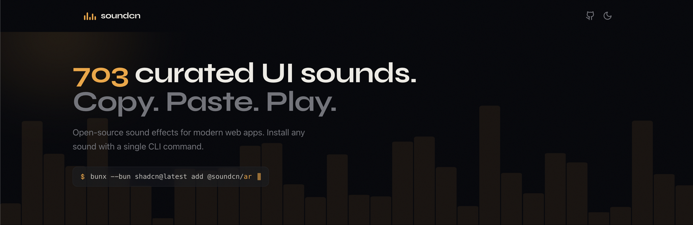

# soundcn



Open-source collection of UI sound effects, installable via [shadcn CLI](https://ui.shadcn.com/docs/cli).

## Problem

Adding sound to web interfaces is tedious. You either hunt for free samples, deal with licensing, wire up audio loading, or pull in heavy libraries — all for a simple button click sound.

## What is soundcn

A curated registry of 700+ short sound effects (clicks, notifications, transitions, game sounds) that you can add to any React project with a single command:

```bash
npx shadcn add @soundcn/click-soft
```

Each sound is a self-contained TypeScript module with an inline base64 data URI — no external files, no runtime fetching, no CORS issues. Sounds are installed directly into your codebase, not as a dependency.

Includes a `useSound` hook for playback via the Web Audio API. Zero dependencies.

## How it works

- Browse sounds at [soundcn.xyz](https://soundcn.xyz/)
- Install any sound — it copies the `.ts` file and the `useSound` hook into your project
- Import and play:

```tsx
import { useSound } from "@/hooks/use-sound";
import { clickSoftSound } from "@/sounds/click-soft";

const [play] = useSound(clickSoftSound);
```

## Thanks all my sponsors

<table align="center">
  <tr>
    <td align="center" width="150"><a href="https://shoogle.dev/"><br/><b>Shoogle</b></a></td>
    <td align="center" width="150"><a href="https://nuqs.dev/"><br/><b>nuqs</b></a></td>
    <td align="center" width="150"><a href="https://beste.co/"><br/><b>Beste</b></a></td>
    <td align="center" width="150"><a href="https://shadcnstudio.com/?utm_source=soundcn&utm_medium=banner&utm_campaign=github"><br/><b>Shadcn Studio</b></a></td>
    <td align="center" width="150"><a href="https://shadcnspace.com/"><br/><b>Shadcn Space</b></a></td>
  </tr>
  <tr>
    <td align="center" width="150"><a href="https://x.com/AliBey_10"><br/><b>Ali Bey</b></a></td>
    <td align="center" width="150"><a href="https://x.com/brobro"><br/><b>Bro Bro</b></a></td>
    <td align="center" width="150"><a href="https://educalvolopez.com/"><br/><b>Edu Calvo</b></a></td>
    <td align="center" width="150"><a href="https://www.orcdev.com/"><br/><b>OrcDev</b></a></td>
    <td align="center" width="150"><a href="https://irsyad.co/"><br/><b>Irsyad A. Panjaitan</b></a></td>
  </tr>
  <tr>
    <td align="center" width="150"><a href="https://chanhdai.com/"><br/><b>Chánh Đại</b></a></td>
    <td align="center" width="150"><a href="https://pro.reactbits.dev/"><br/><b>David Haz</b></a></td>
    <td align="center" width="150"><a href="https://efferd.com/"><br/><b>Shaban</b></a></td>
    <td align="center" width="150"><a href="https://ephraimduncan.com/"><br/><b>Ephraim Duncan</b></a></td>
    <td align="center" width="150"><a href="https://lucide-animated.com/"><br/><b>Dmytro Tovstokoryi</b></a></td>
  </tr>
  <tr>
    <td align="center" width="150"><a href="https://ui.aceternity.com/"><br/><b>Manu Arora</b></a></td>
    <td align="center" width="150"><a href="https://www.aniketpawar.com/"><br/><b>Aniket Pawar</b></a></td>
    <td align="center" width="150"><a href="https://mellowlines.dev/"><br/><b>Alex Kostyniuk</b></a></td>
    <td align="center" width="150"><a href="https://www.kartikk.tech/"><br/><b>Kartik</b></a></td>
    <td align="center" width="150"><a href="https://brodin.dev/"><br/><b>Nathan Brodin</b></a></td>
  </tr>
  <tr>
    <td align="center" width="150"><a href="https://pro.lndev.me/"><br/><b>LN</b></a></td>
  </tr>
</table>

## Stats

[](https://repostars.dev/?repos=kapishdima%2Fsoundcn&theme=minimal)


## License

Most sounds are sourced from CC0-licensed collections (primarily [Kenney](https://kenney.nl)).

The **World of Warcraft collection** (110 sounds) is an exception — those assets are property of Blizzard Entertainment, Inc. and are **not** CC0 or freely licensed. soundcn is not affiliated with or endorsed by Blizzard Entertainment, Inc. World of Warcraft® is a registered trademark of Blizzard Entertainment, Inc. These sounds are included for non-commercial, educational, and reference purposes only.
# aud-b
